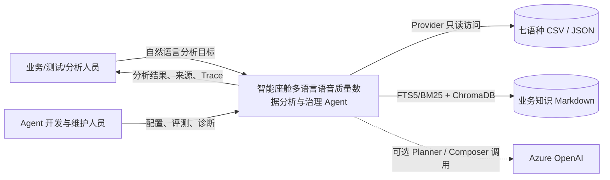
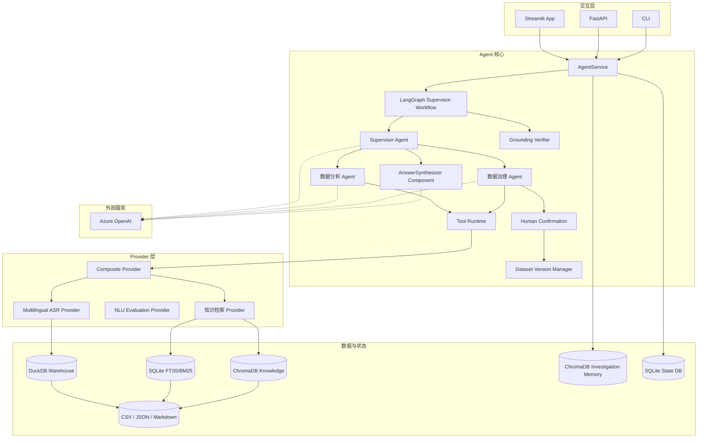
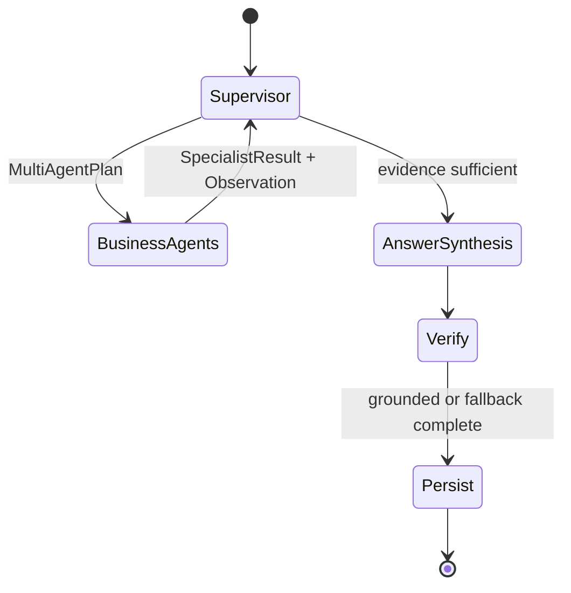
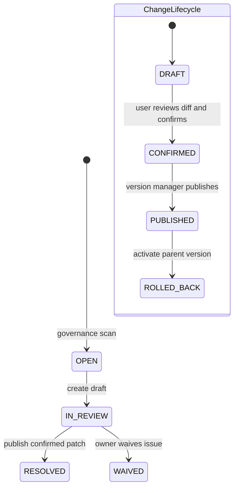
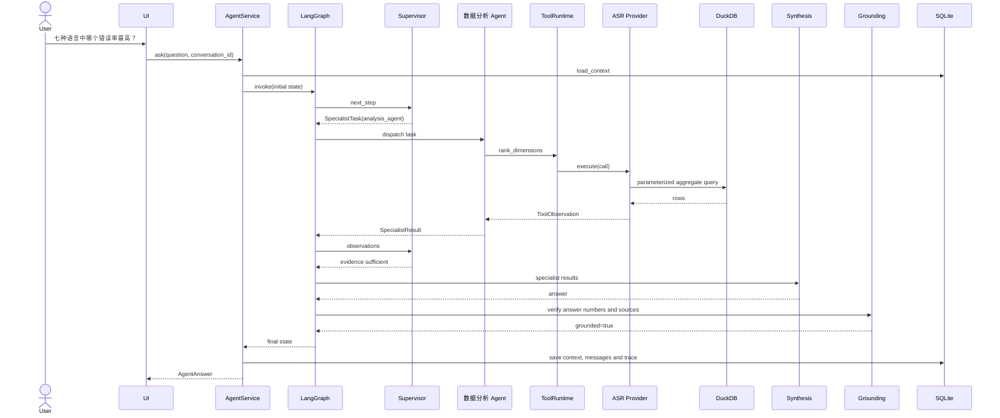
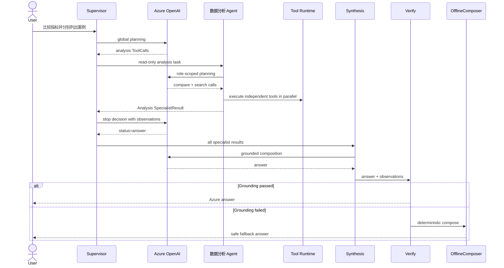
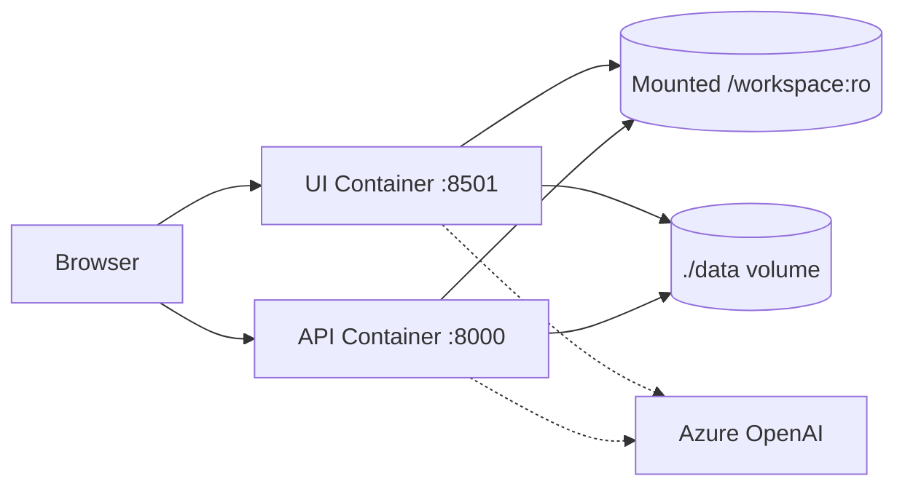

# 智能座舱多语言语音质量数据分析与治理 Agent：架构设计

> 文档类型：软件架构设计说明（SAD）  
> 架构风格：分层架构 + Supervisor-led Multi-Agent + 插件式 Provider  
> 当前部署：单机 Python 应用，Streamlit / FastAPI / CLI 共用核心服务  
> 对应需求：`REQUIREMENTS_DESIGN.md`

---

## 1. 架构目标

架构需要同时满足：

1. 让自然语言问题转化为受控分析任务；
2. 让结构化指标由数据库确定性计算；
3. 支持 Observation 驱动的重新规划；
4. 通过专业 Agent 工具白名单隔离职责；
5. 隔离 Multi-Agent Engine 与具体业务数据格式；
6. 对模型输出执行数字和来源校验；
7. 无 LLM API 时仍可开发、测试和运行；
8. 记录 Agent 路由、Trace、工具指标、LLM token 和评测基线；
9. 以 Data Contract 统一必填、类型、枚举、范围和唯一性规则；
10. 将分析只读权限与治理变更权限分离；
11. 通过结构化 Diff、用户显式确认、版本化补丁和回滚保护原始数据；
12. 通过 NLU Excel Evaluation Provider 验证第二类异构业务数据的 Contract 与 Adapter 扩展边界。

---

## 2. 架构原则

| 原则 | 设计决定 |
|---|---|
| 模型不是真实数据源 | 所有项目事实通过 ToolObservation 提供 |
| 确定性计算优先 | 指标使用 DuckDB，不由 LLM 统计 |
| 规划与执行分离 | Planner 生成 ToolCall，Provider 执行 |
| 专业职责隔离 | Supervisor 委派任务，Analysis/Governance 仅执行各自工具白名单 |
| 业务与引擎分离 | DataProvider、Data Contract 和 Governance Adapter 隔离 ASR 格式与规则 |
| 分析与变更分离 | Analysis 只读；治理 Agent 可提议，但不能确认或直接发布 |
| raw 不可变 | 已确认变更发布为 Patch overlay，源文件不覆盖 |
| 最小 HITL | 用户必须检查 Before/After Diff 和契约结果并显式确认，所有状态变化写 Audit |
| 状态显式化 | LangGraph 保存 MultiAgentPlan、SpecialistResult、Observation 和轮次 |
| 失败可降级 | Azure 不可用或 Grounding 失败时使用离线实现 |
| 可观察 | Trace、ToolStats、LLM telemetry 和 Evaluation |
| 安全默认 | 受控 SQL、轮次限制、返回条数限制、密钥本地化、变更默认不发布 |
| 不过度承诺 | 当前不实现任意 SQL、客服、多 Agent 自由协商或模型自动审批发布 |

---

## 3. 系统上下文



### 外部参与者

- 业务用户：使用分析工作台；
- 开发维护者：查看 Trace、监控和评测；
- 文件系统：当前业务数据源；
- Azure OpenAI：可选外部 LLM 服务；
- 未来 Provider：SQL、Power BI 或其他业务系统。

### 信任边界

- 本机项目与源数据处于内部数据边界；
- Azure OpenAI 是外部模型调用边界；
- 发送到 Azure 的问题、Tool Schema 和 Observation 必须符合公司数据政策；
- API Key 不进入 UI、Trace 或仓库。

---

## 4. 容器架构



---

## 5. 组件目录与职责

| ID | 组件 | 文件 | 职责 |
|---|---|---|---|
| ARC-01 | Interface Adapters | `app.py`, `api.py`, `cli.py` | Web、HTTP 和命令行入口 |
| ARC-02 | AgentService | `service.py` | 装配依赖、执行任务、保存上下文和 Trace |
| ARC-03 | Multi-Agent LangGraph | `multi_agent_graph.py` | Supervisor/Business Agents/Answer Synthesis 状态图 |
| ARC-04 | Supervisor | `multi_agent.py`, `planner.py` | 全局规划、任务拆分和跨轮委派 |
| ARC-05 | Business Agent Pool | `multi_agent.py` | Analysis/Governance 权限隔离与并行执行 |
| ARC-17 | AnswerSynthesizer | `multi_agent.py`, `composer.py` | 非 Agent 组件，汇总 SpecialistResult |
| ARC-18 | Data Contract | `data_contracts.py`, `config/contracts/` | 通用字段规则与契约扫描 |
| ARC-19 | Governance Store | `governance.py` | Issue、Change、Approval、Version 和 Audit |
| ARC-20 | Governance Provider | `providers/governance.py` | 通用治理工具与 ASR Adapter |
| ARC-06 | Tool Runtime | `tool_runtime.py` | 缓存、超时、重试、并行、熔断、统计 |
| ARC-07 | Warehouse | `warehouse.py` | 源文件导入、Schema、指纹、active version 和 Patch overlay |
| ARC-08 | ASR Provider | `providers/asr.py` | ASR 工具目录和 DuckDB 查询 |
| ARC-24 | NLU Evaluation Provider | `providers/nlu.py`, `nlu_warehouse.py` | Excel 报告指纹导入、NLU 指标、错误和标签质量查询 |
| ARC-09 | 知识检索 Provider | `providers/knowledge.py`, `retrieval.py` | 知识数据源适配器；负责 FTS5/BM25、ChromaDB、RRF、轻量重排和引用 |
| ARC-10 | Grounding Verifier | `grounding.py` | 数字和来源路径校验 |
| ARC-11 | Skill Manager | `skills.py`, `skills/` | 动态业务 SOP 加载和注入 |
| ARC-12 | State Store | `memory.py`, `governance.py` | SQLite 工作记忆、ChromaDB 调查记忆、Trace 和治理状态 |
| ARC-13 | Evaluator | `evaluation.py`, `retrieval_evaluation.py`, `judge.py` | 确定性意图/实体/工具/Agent/答案/引用、检索、LLM Judge、基线和回归 |
| ARC-14 | LLM Gateway | `llm.py` | Azure 配置、调用、连接诊断和 telemetry |
| ARC-15 | Schemas | `schemas.py` | Pydantic 跨层契约 |
| ARC-16 | Configuration | `config.py`, `config/sources.yaml` | 项目路径和源目录映射 |
| ARC-21 | MCP Server | `mcp_server.py` | 以 FastMCP 暴露批准的查询工具，不暴露发布和回滚 |
| ARC-22 | High-risk Guard | `safety.py` | 在 LLM 规划前确定性拦截高风险治理动作 |
| ARC-23 | Answer Export | `export.py`, `app.py` | 下载完整 AgentAnswer JSON 或展平 ToolObservation CSV |

---

## 6. Multi-Agent 状态机



当前代码中 Verify 位于 Answer 节点内部，逻辑上单独表示以强调可信门禁。

### 6.1 MultiAgentState

```text
question
context
observations
planning decision
multi_agent_plan
specialist_results
events
rounds
answer
grounded
unsupported_numbers
verification_warnings
```

### 6.2 循环限制

- Planner 最多三轮；
- LangGraph recursion limit 为 12；
- 单轮最多 8 个 ToolCall；
- Tool Runtime 并发线程最多 8；
- 搜索工具最大返回 100 行。

这些限制防止失控循环、资源放大和超大回答。

### 6.3 数据治理状态机

治理生命周期独立于一次聊天请求，状态持久化在 SQLite：



数据治理 Agent 可扫描、查询和预览；确认、发布与回滚只能通过 Service/API 的显式人工操作执行。当前单机版不接入企业身份或 RBAC，操作人字段仅用于本地审计；发布不会覆盖原始文件。旧 `PENDING_APPROVAL` 和 `APPROVED` 记录只做历史兼容。

---

## 7. 关键请求时序

### 7.1 离线简单问题



### 7.2 Azure 复杂问题



---

## 8. 数据架构

### 8.1 源数据

```text
ASR_agent/
├─ Arabic/
├─ English/
├─ French/
├─ German/
├─ Italian/
├─ Portuguese/
└─ Spainsh/   # 配置映射为业务语言 Spanish
```

每种语言当前包含 6 个 domain 的 CSV 和 JSON。

### 8.2 DuckDB 表

#### `asr_cases`

| 字段 | 类型 | 说明 |
|---|---|---|
| case_id | VARCHAR PK | 语言/domain/no/ref/hyp 的稳定哈希 |
| language | VARCHAR | 规范业务语言 |
| domain | VARCHAR | 业务 domain |
| case_no | VARCHAR | 原始 ASR 编号 |
| case_index/case_total | INTEGER | 从编号解析 |
| result_raw | VARCHAR | raw 文件中的原始 Result，允许空字符串 |
| result | VARCHAR | 规范值 correct/error/unknown |
| is_correct | BOOLEAN | 兼容聚合字段；unknown 由 result 单独识别 |
| reference_text | VARCHAR | REF |
| hypothesis_text | VARCHAR | HYP |
| source_path | VARCHAR | 原始 CSV 相对路径 |
| source_row | INTEGER | 原始行号 |
| dataset_version | VARCHAR | 当前行应用的治理版本，默认 raw |

#### `asr_summaries`

保存 JSON 中的 total、correct、errors、accuracy、WER、CER、CSR、生成时间和来源。

#### `data_quality_issues`

保存导入阶段的额外列、短行、空文件、缺失汇总和 CSV/JSON 总量差异。它是 Warehouse 诊断，不等同于治理工作流中的 `governance_issues`。

#### `warehouse_meta`

保存 source fingerprint 和 Provider 标识。

### 8.3 SQLite 状态表

| 表 | 内容 |
|---|---|
| conversations | ConversationContext JSON |
| messages | 用户和 Agent 消息 |
| traces | 事件序列 JSON |
| evaluations | 每次评测的逐条结果 |
| evaluation_runs | 数据集、模式、运行状态、汇总、开始与结束时间 |
| evaluation_judgments | 每条在线用例的 Judge 结果或失败详情 |
| llm_calls | operation、deployment、成功、延迟、token 和错误类型 |
| governance_issues | 契约/Adapter 发现、状态、Owner 和 Resolution |
| change_requests | Before/After、申请人、审批人和变更状态 |
| dataset_versions | parent version、Patch 集合和 active 状态 |
| governance_audit | Issue/Change/Version 的操作人、动作和详情 |

`llm_calls` 不保存 Prompt、回答正文或 API Key。

### 8.4 Hybrid RAG 知识索引

`knowledge_fts` 保存 Markdown 分片并使用 FTS5/BM25 关键词排序；ChromaDB `business_knowledge_*` Collection 保存同一分片的显式 Embedding。查询执行确定性术语改写、两路并行召回、RRF 融合以及关键词覆盖率与向量相似度轻量重排。离线模式使用 384 维特征哈希，配置 Azure Embedding Deployment 后可切换到 `text-embedding-3-small`；Azure Embedding 是非阻塞的可选增强，当前 18 条检索评测不依赖它。

---

## 9. 契约设计

### 9.1 ToolCall

```json
{
  "call_id": "自动生成",
  "name": "compare_languages",
  "arguments": {
    "languages": ["German", "French"],
    "domain": "mediaControl"
  },
  "purpose": "Compare language metrics"
}
```

### 9.2 ToolObservation

```json
{
  "call_id": "...",
  "tool_name": "compare_languages",
  "success": true,
  "data": {"source_scope": "csv_cases"},
  "rows": [],
  "sources": [],
  "warnings": [],
  "elapsed_ms": 37.26,
  "cached": false
}
```

### 9.3 PlanningDecision

```json
{
  "status": "execute",
  "plan": {
    "goal": "...",
    "calls": [],
    "rationale": "..."
  },
  "reason": "..."
}
```

### 9.4 MultiAgentPlan 与 SpecialistResult

```text
MultiAgentPlan
└─ SpecialistTask[]
    ├─ task_id
    ├─ agent
    ├─ objective
    ├─ depends_on
    └─ context / suggested_calls

SpecialistResult
├─ task_id
├─ agent
├─ objective
├─ success
├─ observations[]
├─ summary
├─ warnings
└─ error
```

### 9.5 AgentAnswer

包含：

- question；
- answer_markdown；
- conversation_id；
- trace_id；
- agents_used；
- tools_used；
- specialist_results；
- observations；
- sources；
- warnings；
- context；
- grounded；
- unsupported_numbers。

跨层契约全部由 Pydantic 校验。

### 9.6 Data Contract 与治理契约

`DataContract` 定义 `provider`、`entity`、`primary_key`、`owner`、权威来源和字段规则。字段支持：

- `required` / `allow_blank`；
- `data_type`；
- `allowed_values`；
- `minimum` / `maximum`；
- `unique`；
- `mutable`。

Contract Scanner 只产生 `GovernanceFinding`；同步后才成为持久化 `GovernanceIssue`。字段 Patch 必须对应 `mutable=true`，并经过 `ChangeRequest` 与 `DatasetVersion` 生命周期。

---

## 10. Provider 架构

### 10.1 接口

```python
class DataProvider:
    def tool_catalog(self) -> list[dict]: ...
    def execute(self, call: ToolCall) -> ToolObservation: ...
    def health(self) -> dict: ...
```

### 10.2 Composite Provider

职责：

1. 聚合所有 Provider 的 Tool Schema；
2. 建立 `tool_name -> provider` 路由；
3. 将调用交给拥有该工具的 Provider；
4. 聚合 health 状态。

### 10.3 当前工具目录

ASR Provider：

- platform_capabilities；
- dataset_overview；
- get_metrics；
- compare_languages；
- compare_domains；
- rank_dimensions；
- search_cases；
- get_case_detail；
- compare_source_scopes；
- data_quality。

NLU Evaluation Provider：

- nlu_report_overview；
- nlu_compare_accuracy；
- nlu_error_breakdown；
- search_nlu_errors；
- get_nlu_error_detail；
- nlu_label_quality。

NLU Provider 导入完整汇总指标、标签问题和模型错误明细，但报告不包含全部正确样本逐条记录，因此只能搜索模型错误与标签问题子集。Excel 是不可变评测产物，治理 Issue 可跟踪但不能直接生成 Patch。

知识检索 Provider（知识数据源适配器）：

- search_knowledge。

Data Governance Provider：

- governance_scan；
- list_governance_issues；
- get_governance_issue；
- list_change_requests；
- preview_change。

创建、审批、发布和回滚故意不暴露为 Agent 工具，防止模型绕过人工授权。

### 10.4 新 Provider 接入约束

新 Provider 必须：

- 使用全局唯一工具名；
- 给出 JSON Schema；
- 只返回 ToolObservation；
- 携带来源和 warning；
- 执行参数校验；
- 不在 Engine 中增加业务分支；
- 注册 Data Contract、稳定主键和 mutable 字段；
- 将领域特有检查与 Preview 实现在 Governance Adapter；
- 增加工具与端到端评测。

---

## 11. Tool Runtime 可靠性

### 11.1 执行生命周期

```text
计算缓存 Key
-> 检查 TTL 缓存
-> 检查 Circuit Breaker
-> 在线程池执行 Provider
-> 等待工具超时
-> 填充 elapsed_ms
-> 更新 ToolStats
-> 成功写缓存 / 失败累计计数
```

### 11.2 参数

| 参数 | 当前值 |
|---|---:|
| timeout | 10 秒 |
| cache TTL | 60 秒 |
| max workers | 8 |
| 熔断阈值 | 连续失败 3 次 |
| 熔断时间 | 30 秒 |

### 11.3 当前限制

- 缓存和熔断状态是进程内存；
- 多进程实例之间不共享；
- 没有分布式限流；
- 下一阶段生产化可迁移到 Redis 或网关层。

---

## 12. LLM 架构

### 12.1 AzureLLMGateway

它是唯一直接调用 Azure SDK 的组件，统一处理：

- `.env` / 环境变量配置；
- 安全状态摘要；
- Chat 调用；
- JSON response format；
- timeout/retry；
- connection test；
- token、延迟和错误 telemetry。

Supervisor Planner、专业 Agent 和 Synthesis Composer 不再直接创建 Azure 客户端。

### 12.2 双模式策略

| 模式 | Supervisor | Specialists | Synthesis | 用途 |
|---|---|---|---|---|
| offline | OfflinePlanner | 白名单校验 + 确定性调用 | OfflineComposer | 稳定开发、测试、降级 |
| azure | AzurePlanner | 独立角色 Prompt 细化工具计划 | AzureComposer | 自由表达、多 Agent 规划、自然回答 |
| auto | 配置存在则 Azure，否则 Offline | 同左 | 同左 | 环境自适应 |

### 12.3 数据发送边界

Azure 模式会发送：

- 用户问题；
- ConversationContext；
- Tool Schema；
- SpecialistTask 和角色工具白名单；
- ToolObservation；
- 匹配的 Skills。

不会发送 API Key。内部敏感数据使用前仍需组织安全审批和脱敏策略。

---

## 13. Grounding 架构

### 13.1 当前算法

1. 从 Question 和 Observation JSON 中提取允许数字；
2. 从 Answer 中提取数字；
3. 去除逗号和 `%`；
4. 使用 Decimal 归一化 `2.4` 与 `2.40`；
5. 找出 Answer 中无证据数字；
6. 将 SourceRef 解析到项目或数据根目录；
7. 检查路径是否存在；
8. 返回 grounded、unsupported_numbers 和 warning。

### 13.2 安全动作

Azure 模式 Grounding 失败：

```text
Azure answer rejected
-> OfflineComposer 根据相同 Observation 重新生成
-> 再次 Grounding
-> Trace 增加 deterministic_fallback
```

### 13.3 限制

当前 Grounding 主要防止数字和虚假路径，不等于完整语义事实验证。未来需要：

- Claim extraction；
- Claim-to-evidence mapping；
- Citation Span；
- 语义蕴含检查；
- 人工抽检。

---

## 14. 记忆与 Trace

### 14.1 当前记忆

ConversationContext 保存：

- conversation_id；
- selected_languages；
- selected_domains；
- last_case_ids；
- last_question；
- summary（字段已保留，当前未实现自动压缩）。

### 14.2 Trace 事件

| 事件 | 内容 |
|---|---|
| plan | 首轮 PlanningDecision |
| tool | ToolCall + ToolObservation |
| replan | 后续 PlanningDecision |
| verify | Grounding 结果 |
| answer | Composer 与 fallback 状态 |
| error | 预留错误事件 |

### 14.3 当前限制

- 没有对长对话自动摘要；
- 已实现 ChromaDB 调查记忆，但当前使用确定性回答摘要，尚未使用 LLM 压缩长对话；
- 没有用户画像，这是当前内部质量分析场景的主动边界；
- 工作记忆保存在 SQLite，只有多实例部署时才考虑 Redis。

---

## 15. Agent Evaluation 架构

### 15.1 评测流程

```text
EvaluationCase
-> AgentService.ask
-> 检查 expected_tools
-> 检查 expected_agents
-> 检查 expected_intent / expected_entities
-> 检查 answer_contains
-> 检查 source count + grounded
-> Azure 模式执行 LLM-as-Judge
-> 保存 EvaluationResult
-> 保存 EvaluationRun / EvaluationJudgment
-> 汇总指标及本轮 LLM 用量、P95 和估算费用
-> 与模式基线比较
```

### 15.2 指标

- pass_rate；
- tool_accuracy；
- agent_accuracy；
- intent_accuracy；
- entity_accuracy；
- answer_accuracy；
- citation_accuracy；
- average_ms；
- LLM-as-Judge 五维评分与策略违规；
- per-run calls、tokens、P95_latency_ms 和 estimated_cost_usd。

### 15.3 基线

```text
eval/baselines/core_questions.offline.json
eval/baselines/core_questions.azure.json  # 历史 25/25 确定性在线证据
eval/baselines/azure_smoke.azure.json      # 当前低成本在线基线
```

相对基线下降超过 5% 标记 Regression。更新基线必须由人工确认当前结果后显式执行。
失败、发生回归、Judge 不完整、Judge 平均分低于 4.0、出现策略违规或 Retrieval 未达门槛的运行不能覆盖基线。超过 24 小时的遗留 `RUNNING` 记录会在下次评测启动时标记为 `ABORTED`，新鲜的并行运行不受影响。

---

## 16. API 架构

| Method | Endpoint | 用途 |
|---|---|---|
| GET | `/health` | Provider、Skills、Tool 和 LLM 状态 |
| POST | `/chat` | 执行分析任务 |
| GET | `/tools` | 查看 Tool Schema |
| GET | `/traces/{trace_id}` | 查看执行轨迹 |
| GET | `/skills` | 查看 Skills |
| POST | `/skills/reload` | 重载 Skills |
| GET | `/monitor` | 工具、LLM 和 Provider 指标 |
| GET | `/llm/status` | 安全配置状态 |
| POST | `/llm/test` | 最小 Azure 连接测试 |
| POST | `/eval/run` | 运行指定模式评测 |
| POST | `/governance/scan` | 扫描契约并同步 Issue |
| GET | `/governance/issues` | 查询治理 Issue |
| GET/POST | `/governance/changes` | 查询或创建 Change Draft |
| GET | `/governance/changes/{id}/preview` | 校验并预览 Diff |
| POST | `/governance/changes/{id}/confirm` | 用户检查 Diff 后确认 Change |
| POST | `/governance/publish` | 发布已确认 Change 为新版本 |
| POST | `/governance/rollback` | 激活父版本 |
| GET | `/governance/audit` | 查询治理审计记录 |

FastAPI 服务按 mode 缓存最多三个 AgentService 实例。

---

## 17. 部署架构

### 17.1 当前本地部署

```text
Windows
├─ Python virtual environment
├─ Streamlit :8501
├─ FastAPI :8000（按需启动）
├─ DuckDB files
├─ SQLite files
└─ Source data directories
```

### 17.2 Docker Compose 设计



源数据目录以只读方式挂载，生成的 Warehouse 和 State DB 写入独立 data volume。

当前机器没有 Docker，因此 Compose 已编写但尚未真实运行验收。

### 17.3 生产化目标

下一阶段可拆分：

- Web/API 无状态实例；
- 后台导入与评测 Worker；
- 托管关系数据库；
- Redis 缓存和分布式锁；
- 对象存储或数据湖；
- 企业 Secret Manager；
- OpenTelemetry / Application Insights；
- 更严格的主机访问控制（仅在部署范围扩大后评估）。

---

## 18. 安全设计

### 18.1 主要威胁与控制

| 威胁 | 当前控制 | 后续控制 |
|---|---|---|
| API Key 泄露 | `.env`、gitignore、安全状态不显示值 | Secret Manager、Managed Identity |
| SQL 注入 | 受控 SQL 模板、参数绑定 | Provider 权限和审计 |
| Prompt Injection | 工具白名单、越界拒答、Grounding | Prompt firewall、输入分类和红队评测 |
| 数据外发 | 在线模型为可选，文档明确合规边界 | 数据分级、脱敏和私有网络 |
| 无限 Agent 循环 | 三轮上限、recursion limit | 预算和全局 deadline |
| 超大数据返回 | 工具 limit | 分页和下载任务 |
| 虚假数字/来源 | Grounding 和 SourceRef | Claim-level grounding |
| 任意文件访问 | 配置根目录、评测路径白名单 | 沙箱和最小权限 |
| Agent 直接改 raw | 治理 Agent 无发布工具、raw 只读、Patch overlay | 存储层 WORM/对象锁 |
| Agent 代替用户修改 | Agent 无确认/发布工具、显式 Diff 确认、Audit | 按真实部署风险增加访问控制 |
| 敏感附件进入 RAG | 只索引 Markdown、front matter 来源标记、`index: false` | 自动敏感信息扫描 |

### 18.2 当前不具备

- 用户认证；
- 行级权限；
- 多租户隔离；
- 审计日志防篡改；
- 敏感字段自动脱敏；
- 企业合规认证。

因此当前版本适合受控本机/内部演示，不应直接开放公网。

---

## 19. 可观察性

### 19.1 Tool 指标

- total；
- success_rate；
- average_ms；
- consecutive_failures；
- circuit_state；
- cached flag。

### 19.2 LLM 指标

- calls；
- success_rate；
- p50_latency_ms；
- p95_latency_ms；
- average_latency_ms；
- prompt_tokens；
- completion_tokens；
- total_tokens；
- estimated_cost_usd；
- by_operation；
- error type。

### 19.3 任务级指标

- trace_id；
- tools_used；
- agents_used；
- rounds；
- grounded；
- unsupported_numbers；
- warnings。

### 19.4 当前限制

当前指标主要在 SQLite 和进程内展示，没有集中式日志、分布式 Trace 和告警通知。

---

## 20. 故障与降级矩阵

| 故障 | 行为 |
|---|---|
| Azure 未配置 | 只显示离线模式和配置指引 |
| Azure 连接失败 | 返回连接诊断，不影响离线 Agent |
| Planner 首轮失败 | OfflinePlanner 按相同工具白名单生成确定性计划，Trace 的 reason 标记 fallback 类型 |
| Planner 已有证据后失败 | 使用现有 Observation 进入回答 |
| 专业 Agent LLM 规划失败 | 使用 Supervisor 已验证的建议 ToolCall |
| 专业 Agent 请求越权工具 | 返回 PermissionError SpecialistResult，不执行工具 |
| 单个专业 Agent 工具失败 | 失败写入 SpecialistResult，Supervisor 可根据已有证据继续 |
| Azure Composer 失败 | OfflineComposer 使用已有 Observation 生成回答，Trace 标记 `deterministic_fallback` |
| Azure Answer Grounding 失败 | OfflineComposer 降级 |
| Tool timeout | 返回失败 Observation |
| Tool 连续失败 | 熔断 30 秒 |
| 无搜索结果 | 返回 0 条，不编造结果 |
| 来源不存在 | Grounding 失败并给 warning |
| Warehouse 源文件变化 | 下次初始化自动重建 |
| CSV/JSON 不一致 | 写入质量问题并附口径 warning |

说明：Azure SDK 异常与 Grounding 失败分别处理。前者在 Planner/Composer 边界降级并保留失败类型，后者在 Grounding 后使用确定性回答重组；工具和数据错误不会被该机制静默吞掉。

---

## 21. 架构决策记录摘要

### ADR-001：使用 DuckDB 而不是把数据塞进 Prompt

原因：精确、可复现、适合本地分析、无外部服务依赖。

### ADR-002：使用 Provider 而不是在 Planner 中解析文件

原因：隔离业务格式，支持未来扩展数据源。

### ADR-003：保留 Offline Planner

原因：无 API 可运行、稳定回归、降级和成本基线。

### ADR-004：Hybrid RAG 使用 FTS5/BM25 + ChromaDB

原因：FTS5/BM25 适合 ASR、Domain、错误码等精确术语，ChromaDB 适合语义表达；RRF 融合避免直接比较不同分数量纲。ChromaDB 可嵌入当前单机 Python 进程，比 Milvus 或为向量单独引入 PostgreSQL/pgvector 更符合当前规模。

### ADR-005：不允许任意 SQL

原因：安全、可测试、指标口径稳定；使用受控工具覆盖核心需求。

### ADR-006：SQLite 保存本地状态

原因：MVP 单机部署简单；未来可替换为托管数据库。

### ADR-007：Grounding 在回答后执行

原因：阻止模型输出无证据数字和虚假路径，并支持确定性降级。

### ADR-008：不命名为智能客服

原因：当前处理数据分析，不具备订单、工单、人工转接和服务 SLA。

### ADR-009：采用 Supervisor-led Multi-Agent 而不是 Agent 自由对话

原因：数据分析任务具有明确工具和可验证依赖。Supervisor 协作可以实现角色隔离、并行和重规划，同时控制 token、延迟和错误传播。

### ADR-010：专业 Agent 使用静态工具所有权

原因：防止模型或 Supervisor 错误委派造成越权执行，并让 Agent Accuracy 可以端到端评测。

### ADR-011：只保留三个业务 Agent

原因：Supervisor、Analysis 和 Governance 分别拥有协调、只读解释、受控数据生命周期三个独立目标。指标、案例和知识只是 Analysis 的工具能力；AnswerSynthesizer、Grounding 和人工确认是组件或人工节点，不包装成 Agent。

### ADR-012：raw 不可变并使用版本化 Patch

原因：直接覆盖业务源文件难以审计和回滚。发布创建带 parent version 的 Patch overlay，Warehouse 重建时应用 active version；回滚只切换版本并重建。

### ADR-013：治理变更采用最小显式 HITL

原因：当前是受控单机项目，引入企业身份、RBAC 和双人审批会显著增加复杂度但没有真实组织需求。系统保留结构化 Diff、Data Contract 校验、用户显式确认、Audit、不可变版本和回滚；模型无权替代用户确认。

### ADR-014：通用 Contract + 领域 Adapter

原因：仅重命名 ASR 字段不能形成通用平台。required/type/enum/range/unique 进入 Contract Scanner，ASR 编号、跨文件范围和额外列等规则留在 Adapter。

---

## 22. 扩展路线

### 已完成：真实 LLM 双轨验收

- Microsoft Entra ID 真实连接、静默凭据缓存、简单与复合问题已验收；
- 历史 25 条 Azure 完整回归的六项确定性指标全部通过；
- 当前 6 条 Azure smoke 全部通过，Judge 平均 4.7/5 且无策略违规；
- 评测运行、逐条 Judge、per-run token、成本和 P95 已持久化；
- 日常默认运行 6 条 smoke，25 条完整回归需显式确认费用。

### 已完成：工程质量门禁与故障降级

- Ruff 检查语法、未定义符号、未使用导入和 import 顺序；
- Mypy 检查 Schemas、Safety、Grounding、Export 和 Tool Runtime 稳定核心；
- GitHub Actions 在无私有业务数据环境运行 40 条测试、依赖检查、漏洞扫描和 Docker Demo 健康检查；
- 本地脚本串行执行 78 条测试及核心/银标/NLU Agent 回归；
- 显式 Synthetic Demo 生成 42 条 ASR 与 14 条 NLU fixture，使用独立运行时目录且不会污染真实 Warehouse；
- Dependabot 每周监控 Python 与 GitHub Actions 依赖；
- Azure Planner/Composer 故障注入验证确定性 fallback 与 Trace 标记；
- 25 条顺序离线基线记录端到端 P50/P95，不作为生产 SLA。

### P2：增强知识与可信度

- 增加正式政策、domain 定义、SOP 和已知问题；
- 原始 PDF/DOCX 先脱敏并生成带来源元数据的 Markdown，不直接进入索引；
- 用真实日志抽样补充合成银标，不把银标准确率外推到生产；
- Hybrid RAG；
- Reranker；
- Citation Span；
- Claim-level Grounding。

### 已完成：第二 Provider 平台化验证

- 接入真实 NLU Excel Evaluation Provider；
- CompositeProvider 强制工具名唯一，避免插件静默覆盖；
- Supervisor 支持 ASR + NLU 同轮跨 Provider 查询；
- 合成 Excel fixture 在无私有数据 CI 中验证导入、查询和只读治理；
- 7 条 NLU/跨 Provider Agent 回归六项指标全部通过。

### P3：继续扩展平台化

- 增加企业数据源连接器、Schema Drift 和批量导入；
- 增加导出与报告组件；
- 增加跨快照趋势和版本 Diff。

### P4：生产化

- 根据真实部署边界决定是否增加认证和权限控制；
- 后台任务和持久队列；
- 分布式缓存；
- OpenTelemetry；
- CD 与多环境发布；
- 压力、安全和灾备测试。

---

## 23. 架构验收清单

- [x] UI、API、CLI 共用 AgentService；
- [x] Planner 不直接读取业务文件；
- [x] Supervisor 不直接执行业务工具；
- [x] 专业 Agent 工具白名单可阻止越权；
- [x] SpecialistTask 和 SpecialistResult 通过 Pydantic；
- [x] Provider 不决定工具执行顺序；
- [x] 所有跨层对象通过 Pydantic；
- [x] 指标只由 DuckDB/工具计算；
- [x] 复杂问题可发生 Replan；
- [x] 独立专业 Agent 和工具可并行；
- [x] 有依赖任务可根据 Observation 跨 Agent 重规划；
- [x] 回答经过 Grounding；
- [x] Trace 可回放主要节点；
- [x] Azure 配置和调用集中在 Gateway；
- [x] LLM telemetry 不保存 Prompt 或 Key；
- [x] 25 条 Multi-Agent 回归集通过；
- [x] 62 条合成银标集单独报告并通过；
- [x] 结构化 TaskUnderstanding 同时保留复合指标和多来源范围；
- [x] Intent Accuracy 和 Entity Accuracy 进入基线及 Regression 检测；
- [x] Agent Accuracy 进入基线和 Regression 检测；
- [x] Retrieval Eval 通过 Recall@3 >= 0.90、MRR >= 0.75 的门槛；
- [x] Grounding 校验数字、关键业务实体、来源范围和路径；
- [x] 非 ASR Data Contract 扫描测试通过；
- [x] 治理预览输出结构化 before/after Diff 和 Data Contract 检查；
- [x] Issue、Change、用户确认、Dataset Version 和 Rollback 测试通过；
- [x] PDF/DOCX 原件不直接索引，派生知识携带来源与验证日期；
- [x] Tool Runtime 超时、重试、熔断和冷却恢复测试通过；
- [x] 发布和回滚不修改 raw 文件；
- [x] 基线 Regression 检测正常；
- [x] 源数据只读；
- [x] 未实现能力在文档中明确标注。
