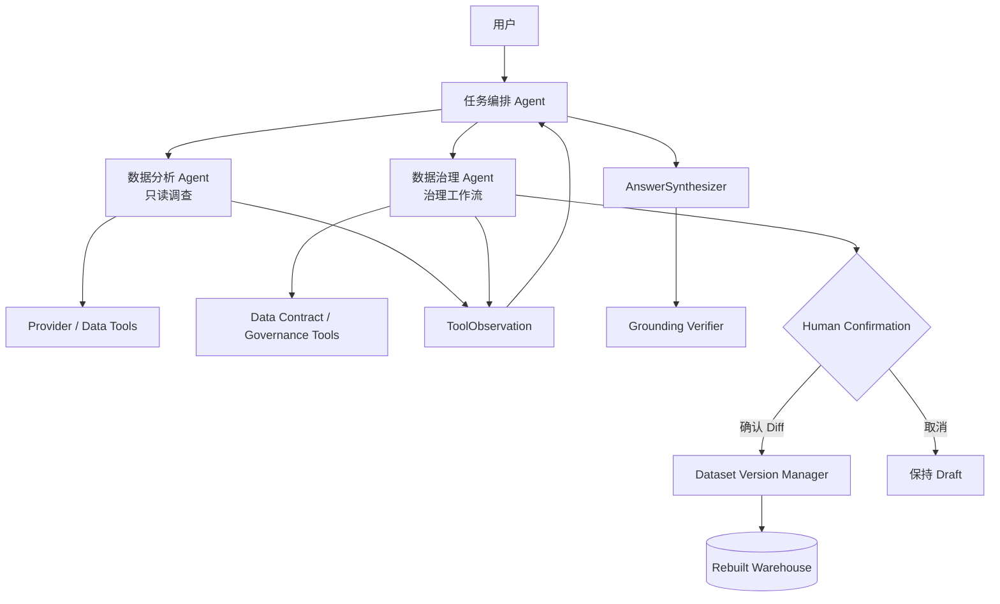

# 智能座舱多语言语音质量数据分析与治理 Agent：三 Agent 设计

> 最终业务角色：任务编排 Agent、数据分析 Agent、数据治理 Agent  
> 非 Agent 组件：AnswerSynthesizer、Grounding Verifier、Human Confirmation、Dataset Version Manager、Tool Runtime  
> 当前落地：七语种 ASR + 离线 NLU 重测报告；通用边界：Data Contract + Provider + Governance Adapter

## 1. 为什么只保留三个 Agent

指标、案例和知识都服务于同一个目标：完成一次只读数据调查。按工具拆成三个顶层 Agent 会显得刻意，因此它们合并为数据分析 Agent。

Data Governance 有不同的业务目标和生命周期：发现质量问题、跟踪 Issue、提出 Patch、等待用户确认、发布版本、验证和回滚。它具有独立状态和受控写入生命周期，因此值得成为独立 Agent。

最终结构：



## 2. 任务编排 Agent

业务目标：识别用户是在做只读分析、数据治理，还是两者结合，并控制执行轮次。

职责：

- 读取问题和 ConversationContext；
- 选择数据分析 Agent 或数据治理 Agent；
- 对无依赖任务并行委派；
- 根据 SpecialistResult 和 Observation 再规划；
- 判断证据是否充分；
- 不直接执行 DuckDB、FTS5 或治理写操作。

示例：

```text
“七种语言中哪个错误率最高？”
-> 数据分析 Agent

“扫描当前数据质量问题”
-> 数据治理 Agent

“扫描质量问题，并分析整体指标影响”
-> 数据治理 Agent + 数据分析 Agent
```

## 3. 数据分析 Agent

业务目标：完成只读业务数据调查。

内部能力：

- 指标、聚合、比较和排名；
- 记录搜索和详情；
- 来源口径比较；
- 数据质量只读查询；
- 业务知识检索；
- 越界拒答。

权限：只读，不创建 Change Request，不确认，不发布版本。

当前工具包括 ASR 指标/案例工具、NLU 指标/错误工具和 Hybrid RAG 知识工具。ASR 与 NLU 联合问题由任务编排 Agent 同轮委派给同一个数据分析 Agent，不因新增数据源增加新的 Agent。

为什么这些能力属于一个 Agent：指标、案例和知识通常是同一项调查的不同证据，而不是独立业务流程。

## 4. 数据治理 Agent

业务目标：将数据异常变成可追踪、可确认、可回滚的治理流程。

职责：

- 根据 Data Contract 扫描通用质量规则；
- 调用 Provider-specific Adapter 执行业务检查；
- 持久化 Governance Issue；
- 查询 Issue 和 Change Request；
- 为字段级问题创建 Change Draft；
- 生成 Diff Preview 和契约校验结果；
- 等待用户检查结构化 Diff 与契约结果。

禁止：

- 不能由聊天 Planner 自动确认或发布；
- 不能覆盖 raw 文件；
- 不能自动修复业务语义不明确的问题；
- 不能直接修改金额、标签或正式基线。

当前治理工具：`governance_scan`、`list_governance_issues`、`get_governance_issue`、`list_change_requests` 和 `preview_change`。

确认、发布与回滚只通过显式 UI/API 人工动作完成。当前单机版使用本地操作标识写 Audit，不接入企业身份、RBAC 或双人审批。

## 5. 通用 Data Contract

每个 Provider 使用 YAML 定义：

```yaml
contract_id: sales-order
provider: sales
entity: order
primary_key: order_id
fields:
  - name: order_id
    required: true
    unique: true
  - name: amount
    data_type: number
    minimum: 0
  - name: status
    allowed_values: [created, paid, cancelled]
```

通用 Contract Scanner 支持：

- REQUIRED_MISSING；
- BLANK_NOT_ALLOWED；
- TYPE_MISMATCH；
- VALUE_NOT_ALLOWED；
- VALUE_BELOW_MINIMUM / ABOVE_MAXIMUM；
- DUPLICATE_VALUE。

它已经使用非 ASR 的临时销售订单测试验证，能发现重复订单号、空客户、非法状态和负金额。

## 6. Provider 与 Governance Adapter

Provider 负责数据读取和分析工具；Governance Adapter 负责该数据源特有的治理检查与安全 Patch。

ASR Adapter 当前检查：

- 空或非法 Result；
- CSV/JSON 总数和结果口径差异；
- Case 编号断档与分母不一致；
- 空 HYP 复核；
- 未映射的非空额外列；
- Warehouse 导入 warning。

NLU Adapter 当前检查：

- Arabic / Saudi_Arabic 语言命名口径；
- exact_grade / ratio 数值槽位类型；
- 模型预测 JSON 解析失败；
- 标签问题和模型错误明细重复行。

NLU Excel 是不可变评测产物，Issue 可以跟踪，但修正必须回到权威测试集，不能对报告本身创建 Patch。通用状态机和任务编排能力无需重写。

## 7. 治理生命周期

```text
Contract Scan
-> Governance Issue OPEN
-> Change Request DRAFT
-> CONFIRMED（用户检查 Diff 与契约结果）
-> PUBLISHED
-> Dataset Version ACTIVE
-> Post-publish rebuild and validation
-> ROLLED_BACK（必要时）
```

聊天 Agent 不能确认自己的建议。用户确认、发布和回滚均写入 `governance_audit`。

## 8. 数据修改策略

raw CSV/JSON 永不覆盖。确认后的修正保存为累积 Patch Dataset Version：

```json
{
  "entity_key": "french-mediacontrol-...",
  "field_name": "result_raw",
  "before_value": "",
  "proposed_value": "✗",
  "change_id": "CHG-..."
}
```

Warehouse 重建时读取 active version，并把 Patch 应用到分析层。回滚只需重新激活 parent version 并重建。

测试已验证：空 Result 在 raw 中保持不变；发布后 Warehouse 从 unknown 变成 error；回滚后恢复 unknown。

## 9. 当前真实治理结果

当前扫描得到 44 个候选：

- 1 error：French mediaControl Result 为空；
- 41 warning：双口径差异、编号异常、额外列等；
- 2 info：Spanish 空 HYP，需要人工判断是否为合法 no-recognition。

并非 44 个都应修改。范围级口径差异没有单字段 Patch，必须由数据 Owner 提供修正版文件或确认权威来源。

NLU 报告扫描得到 49 个聚合候选，覆盖语言命名、数值槽位类型、24 条预测解析失败以及重复明细。它们作为只读治理 Issue 持久化，不允许直接修改 Excel 报告。

## 10. 为什么这套三 Agent 不是强行设计

| Agent | 独立目标 | 独立状态 | 独立权限 | 独立成功标准 |
|---|---|---|---|---|
| 任务编排 | 正确理解、拆解和协调 | 结构化意图/实体、全局计划、轮次、Observation | 委派，无业务写权 | Intent/Entity/Agent Accuracy、任务完成率 |
| Analysis | 完成只读调查 | Analysis Result、Sources | 只读工具 | Tool/Answer/Citation Accuracy |
| Data Governance | 关闭质量问题并安全发布 | Issue、Change、Confirmation、Version、Audit | 草稿与治理状态；发布需人工确认 | 问题关闭率、确认覆盖率、可回滚率 |

AnswerSynthesizer 只格式化证据，Grounding 只校验，Human Confirmation 是人工门禁，它们没有被包装成 Agent。

## 11. 对其他业务数据的扩展

新数据接入最少需要：

1. Provider：读取与分析工具；
2. Data Contract：字段、主键、类型、枚举、范围和 mutable；
3. Governance Adapter：业务特有检查和安全 Patch；
4. Knowledge/Skills：指标定义和治理 SOP；
5. 回归评测：问题、工具、Agent 和来源期望。

通用 Contract Scanner、Issue/Change/Confirmation/Version/Audit 状态机和任务编排能力不需要重写。

## 12. 后续 Agent 边界

Reporting Agent 只有在存在草稿、审阅、发布和归档流程时增加；仅导出 CSV 是工具。

Experiment Agent 只有在获得 baseline/candidate 两个真实版本、实验 owner 和验收阈值后增加；当前不创建空 Agent。

## 13. 简历表述

> 设计并实现任务编排式智能座舱语音质量数据分析与治理 Agent，接入 ASR CSV/JSON 与 NLU Excel/嵌套 JSON 两个真实 Provider；构建只读数据分析 Agent 与数据治理 Agent，通过通用数据契约、Provider-specific Adapter、结构化 Diff、用户确认和版本回滚实现原始数据不可变与可审计治理闭环。