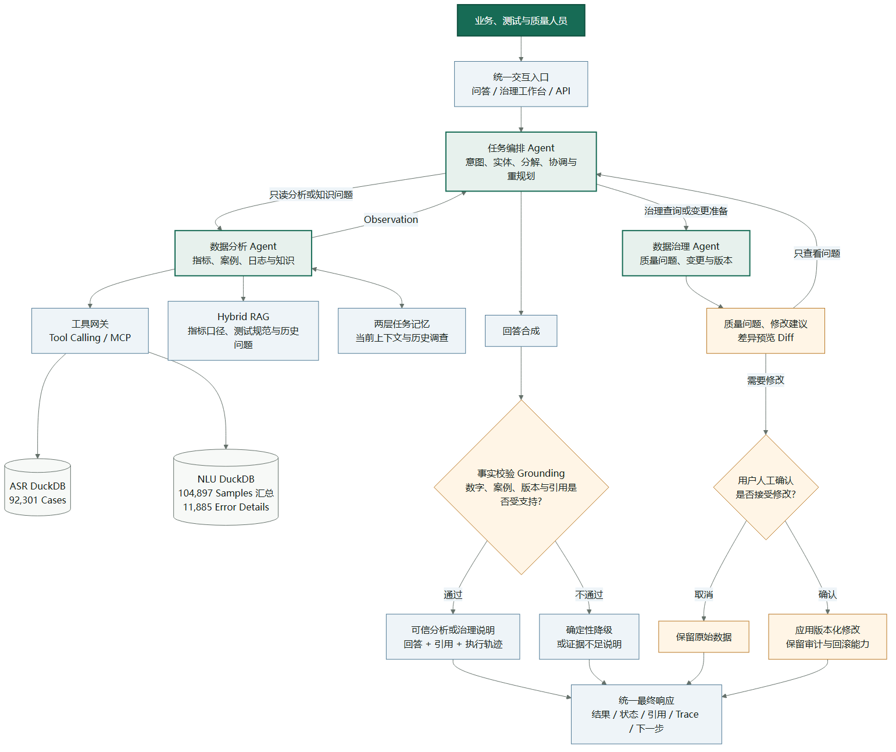
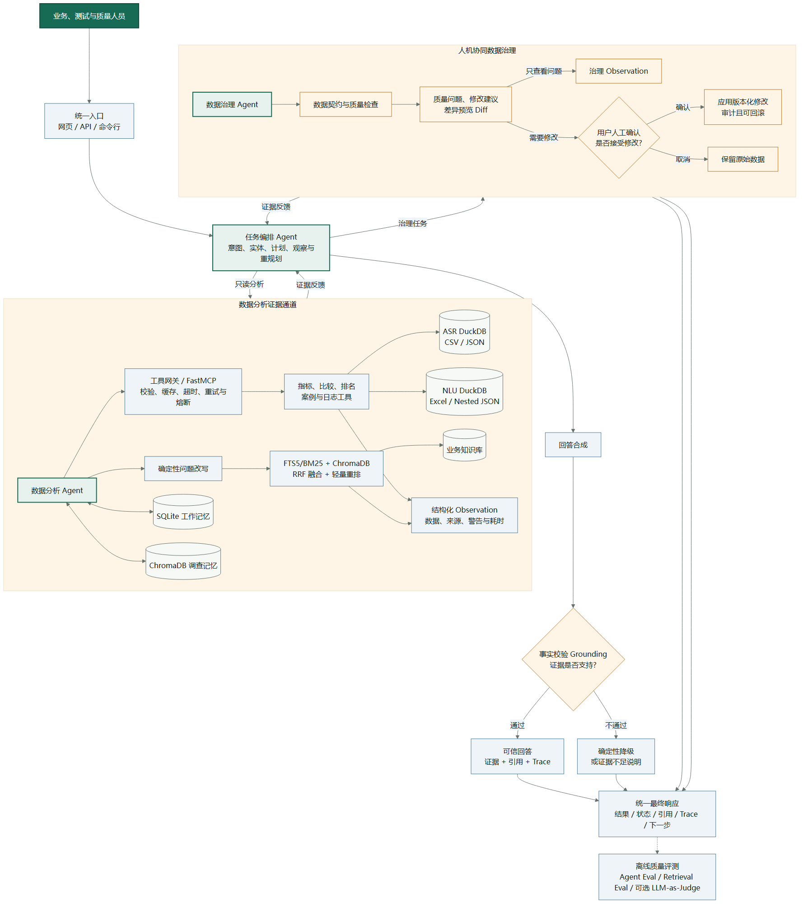

# 智能座舱多语言语音质量数据分析与治理 Agent 项目说明书

> 文档定位：项目统一说明、技术设计、领导汇报、简历与面试讲解的唯一主文档  
> 项目名称：智能座舱多语言语音质量数据分析与治理 Agent  
> 项目简称：智能座舱语音质量 Agent  
> 英文名称：Intelligent Cockpit Multilingual Voice Quality Data Agent  
> 当前落地场景：七语种车载 ASR 测试与质量数据  
> 目标形态：面向企业业务数据的智能分析与受控治理平台  
> 版本：1.0

---

## 0. 阅读说明

本文回答以下问题：

1. 为什么要做这个项目；
2. 项目解决什么业务问题；
3. 为什么需要 Agent，而不是普通报表或聊天机器人；
4. 整体系统如何运行；
5. 采用了哪些典型且高含金量的 Agent 技术；
6. 每项技术分别是什么、为什么使用、在项目中如何落地；
7. 如何保证回答准确、数据安全和变更可回滚；
8. 当前已经具备什么基础，目标版本还需要补充什么；
9. 如何向领导、简历筛选人员和面试官介绍项目。

本文以中文描述为主。首次出现专业术语时会保留英文名称，后续优先使用中文名称。

---

## 1. 项目执行摘要

本项目面向智能座舱多语言语音测试与质量数据，建设一套能够使用自然语言完成数据分析、案例调查、知识检索和数据治理的智能 Agent。

用户不需要了解文件目录、数据库表或 SQL，只需提出问题，例如：

- “七种语言中哪个错误率最高？”
- “比较德语和法语 mediaControl 的错误率，并分别给出三条错误案例。”
- “准确率指标的计算口径是什么？”
- “当前数据有哪些质量问题？”
- “这个数据问题是否可以修正，修改后会影响哪个版本？”

系统首先通过确定性安全门禁识别修改、发布、回滚等高风险表达，再由任务编排 Agent 在一次规划中完成任务类型与关键实体理解、任务拆解和专业 Agent 选择，协调数据分析 Agent 或数据治理 Agent 执行。结构化指标和案例由 DuckDB 与受控工具计算，业务知识由混合检索增强生成检索，Agent 只负责理解、规划、调用工具和组织证据。

回答生成后，系统会校验数字、事实和来源；数据修改不会由 Agent 直接执行，而是经过问题登记、结构化差异预览、用户显式确认、版本发布和回滚。

一句话概括：

> **让业务、测试和质量人员使用自然语言获得可信的数据结论，并让发现的数据问题通过可确认、可审计、可回滚的流程得到治理。**

---

## 2. 项目背景

### 2.1 命名与业务边界

项目使用“智能座舱”作为业务领域名称，因为当前数据覆盖车辆控制、媒体、导航、电话和系统控制等座舱语音交互能力，比“车机系统”更能体现完整业务背景，也更符合行业和简历表达。

同时，项目名称加入“多语言语音质量数据”，用于限制范围：当前首个落地场景是车载 ASR 测试与治理，并不宣称已经覆盖智能座舱中的视觉感知、驾驶员监测、推荐系统、娱乐内容或硬件控制等全部模块。

因此两种表述分别用于：

- **智能座舱多语言语音质量数据**：项目定位与业务领域；
- **七语种车载 ASR 测试数据**：当前实际落地数据源。

### 2.2 业务背景

智能座舱语音交互系统需要在不同语言和车辆控制、媒体、导航、电话等业务领域中进行大量测试。当前首个落地数据源为七语种车载 ASR 测试结果，包含：

| 数据项 | 当前规模 |
|---|---:|
| 语言 | 7 种 |
| 业务领域 | 6 个 |
| CSV 文件 | 42 份 |
| JSON 文件 | 42 份 |
| 测试案例 | 92,301 条 |
| 错误案例 | 5,118 条 |
| 结果未知 | 1 条 |

覆盖语言：阿拉伯语、英语、法语、德语、意大利语、葡萄牙语、西班牙语。

覆盖业务领域：车辆控制、通用控制、媒体控制、导航控制、电话和系统控制。

### 2.3 传统工作方式

一次跨语言分析通常需要：

1. 定位语言和业务领域目录；
2. 打开多个 CSV 或 JSON 文件；
3. 计算总数、正确数、错误数、准确率和错误率；
4. 比较不同语言或业务领域；
5. 筛选并整理具体错误案例；
6. 核对 CSV 与 JSON 的统计范围；
7. 查阅指标定义、测试规范和历史问题；
8. 将结论、来源和案例整理成汇报材料；
9. 发现数据问题后，线下确认是否修改以及如何修改。

### 2.4 主要痛点

| 痛点 | 具体表现 | 业务影响 |
|---|---|---|
| 数据分散 | 多语言、多领域、多文件格式 | 查找与汇总成本高 |
| 分析重复 | 相似问题反复筛选和计算 | 响应慢，依赖熟练人员 |
| 口径不统一 | CSV 与 JSON 可能代表不同范围 | 容易混用数据 |
| 知识分散 | 指标、规范、历史问题分散在文档中 | 结论缺少统一依据 |
| 过程不可追溯 | 查询过程与最终结论分离 | 复核和责任确认困难 |
| 数据修改不受控 | 直接改源文件或口头确认 | 缺少审批、版本和回滚 |
| 普通大模型不可靠 | 无法稳定统计大量记录 | 可能产生数字幻觉 |

---

## 3. 建设动机

### 3.1 为什么不是普通报表

固定报表适合展示预先定义的指标，但业务人员经常提出临时组合问题：

```text
先找出错误率最高的两个语言
-> 再分别查询错误案例
-> 再解释指标口径
-> 最后检查这些数据是否存在质量问题
```

这类任务需要根据第一步结果决定下一步，无法完全用固定报表覆盖。

### 3.2 为什么不是普通聊天机器人

聊天机器人擅长生成自然语言，但不能可靠计算 92,301 条记录，也不能自动证明数字来自哪里。

本项目要求：

- 指标必须由数据库计算；
- 案例必须来自真实记录；
- 知识结论必须引用业务文档；
- 数据修改必须经过审批；
- 每一步执行都可以回放和评测。

### 3.3 为什么需要 Agent

Agent 的价值不是“会聊天”，而是能够围绕目标形成循环：

```text
理解目标
-> 制定计划
-> 调用工具
-> 读取观察结果
-> 判断证据是否充分
-> 必要时继续调查
-> 输出结论
```

复杂问题的后续动作来自前一轮真实结果，这就是 Agent 相比固定工作流的核心价值。

---

## 4. 项目目的

### 4.1 业务目标

1. 降低业务数据查询和分析门槛；
2. 缩短跨语言、跨业务领域的分析时间；
3. 统一结构化指标和业务知识口径；
4. 让每个数字、案例和结论可以追溯；
5. 让历史调查经验可以复用；
6. 让数据修改经过审批、版本化并可回滚；
7. 将智能座舱语音质量场景沉淀为可扩展的企业数据 Agent 能力。

### 4.2 技术目标

1. 建立可解释的任务路由；
2. 建立结构化数据与非结构化知识双通道；
3. 建立标准化、可靠的工具调用层；
4. 建立多轮任务记忆；
5. 建立事实校验和引用机制；
6. 建立确定性评测与大模型评审双轨体系；
7. 建立人机协同的数据治理闭环。

### 4.3 非目标

当前项目不以以下能力为主要目标：

- 面向消费者的智能客服；
- 让大模型自由执行任意 SQL；
- 让 Agent 自动修改生产数据；
- 为了数量而拆分大量 Agent；
- 构建与业务无关的用户画像；
- 在没有多实例选择时实现动态 Agent 降权；
- 在没有验证前宣称生产级可用性。

---

## 5. 目标用户与核心场景

### 5.1 目标用户

| 用户 | 主要诉求 |
|---|---|
| 测试人员 | 快速计算指标、定位错误案例 |
| 质量人员 | 发现数据问题、跟踪治理状态 |
| 业务人员 | 理解语言和业务领域表现 |
| 研发人员 | 获取具体案例、日志和历史问题 |
| 数据负责人 | 审批修正、发布版本、执行回滚 |
| 管理人员 | 获取可追溯的概览和风险结论 |

### 5.2 四类任务

| 任务类型 | 示例 | 主要能力 |
|---|---|---|
| 指标分析 | 哪个语言错误率最高 | 数据工具 |
| 案例调查 | 给出三条德语错误案例 | 案例与日志工具 |
| 知识问答 | 准确率口径是什么 | 混合 RAG |
| 数据治理 | 扫描问题、申请修正、查看版本 | 治理状态机 |

### 5.3 复合任务

系统需要支持多种能力组合：

> “比较英语和阿拉伯语错误率，解释指标口径，并检查相关数据质量问题。”

任务编排 Agent 会拆分为：

1. 数据分析 Agent 计算两种语言指标；
2. 数据分析 Agent 通过 RAG 检索指标定义；
3. 数据治理 Agent 扫描或查询质量问题；
4. 汇总证据后执行事实校验。

---

## 6. 设计原则

### 6.1 模型与事实分离

- 大语言模型负责理解、规划和表达；
- DuckDB 负责指标与案例；
- RAG 负责业务知识；
- 治理数据库负责审批和版本状态；
- 模型不能把记忆当作最新权威事实。

### 6.2 只保留必要的 Agent

平台保留三个业务 Agent：

- 任务编排 Agent：规划和协调；
- 数据分析 Agent：只读调查；
- 数据治理 Agent：质量问题和变更生命周期。

知识检索是数据分析 Agent 的一种证据能力，不单独包装为知识 Agent。

### 6.3 高风险动作不交给模型

审批、发布和回滚不进入大模型工具目录，必须由经过身份确认的人工操作完成。

### 6.4 证据优先

回答必须尽量附带：

- 数据来源；
- 原始文件或文档；
- 查询参数；
- 执行轨迹；
- 校验结果。

### 6.5 先保证正确，再追求自然

结构化事实先通过确定性方法验证，再使用大模型优化表达。

---

## 7. 总体架构



主架构可以划分为六层：

| 层级 | 主要职责 |
|---|---|
| 交互层 | 网页、接口和命令行入口 |
| Agent 编排层 | 计划、分工、观察和重规划 |
| 工具与检索层 | 数据工具、MCP、混合 RAG |
| 记忆层 | 当前任务上下文和历史调查经验 |
| 可信层 | Grounding、引用和确定性降级 |
| 数据治理层 | 质量问题、修改建议、用户确认和版本化应用 |

详细架构如下：



架构图阅读说明：

1. **统一入口直接进入任务编排。** 主图不再展开前置安全门禁，突出自然语言任务的理解、拆解和专业 Agent 协作。
2. **专业 Agent 通过 Observation 回到任务编排 Agent。** 数据分析或治理查询的结果不是直接拼成最终回答，而是先作为结构化证据写回，任务编排 Agent 再判断继续调查还是结束。
3. **数据修改采用简单的人机协同。** 数据治理 Agent 给出质量问题、修改建议和结构化差异预览；用户检查 Diff 与 Data Contract 结果并确认后，系统应用版本化修改，取消则保持原始数据不变。当前单机版不引入企业身份、RBAC 或独立审批人。
4. **所有用户可见结果汇入统一响应。** 正常可信回答、证据不足降级、取消修改和修改完成都统一返回结果、状态、引用、Trace 和下一步建议。
5. **评测只作为旁路能力。** 图中只保留一个离线质量评测节点，不展开基线和回归门禁；完整机制仍在评测章节和代码中保留，不参与每次在线回答。

---

## 8. 核心业务流程

### 8.1 统一入口与任务编排

```text
用户请求
-> 任务编排 Agent 识别意图和实体
-> 拆解任务并选择数据分析 Agent 或数据治理 Agent
-> 根据 Observation 判断继续调查还是生成回答
```

### 8.2 分析流程

```text
用户问题
-> 识别任务类型、实体和风险
-> 任务编排 Agent 制定计划
-> 数据分析 Agent 调用数据工具或 RAG
-> 工具返回 Observation 和来源
-> 任务编排 Agent 判断是否继续
-> 回答合成
-> Grounding 校验数字、事实和引用
-> 可信回答或确定性降级
-> 统一最终响应
```

### 8.3 治理流程

```text
数据契约扫描
-> 治理问题 Issue
-> 修改建议与差异预览 Diff Preview
-> 用户人工确认是否接受修改
-> 取消：保持原始数据 -> 统一最终响应
-> 确认：应用版本化修改 -> 统一最终响应
```

说明：代码中保留状态校验、审计、发布失败恢复和回滚能力；历史 `PENDING_APPROVAL/APPROVED` 状态仅用于兼容旧记录，当前产品流程为 `DRAFT → CONFIRMED → PUBLISHED → ROLLED_BACK`。

### 8.4 多轮调查流程

```text
第一轮：比较七种语言错误率
-> 保存排名和筛选条件
第二轮：最高两个语言各给三条案例
-> 继承第一轮结果调用案例工具
第三轮：解释它们的指标口径
-> 检索业务知识并引用文档
```

---

## 9. Agent 角色设计

### 9.1 任务编排 Agent（Supervisor Agent）

命名说明：它不叫“路由 Agent”，因为路由只是选择任务去向；该 Agent 还负责首轮意图与实体理解、任务拆解、依赖管理、并行调度、证据判断和基于 Observation 的重规划。当前只有两个专业 Agent，单独增加一个 LLM 路由器会与首轮规划重复，因此这些能力合并在任务编排 Agent 中；其前面只保留不调用 LLM 的高风险规则门禁。

职责：

- 理解用户目标；
- 读取当前任务上下文；
- 识别任务依赖；
- 调度数据分析 Agent 和数据治理 Agent；
- 并行执行无依赖任务；
- 根据 Observation 决定是否重规划；
- 判断证据是否充分；
- 不直接操作业务数据。

成功标准：

- 路由正确；
- 任务拆解合理；
- 没有越权调用；
- 在有限轮次内完成任务。

### 9.2 数据分析 Agent（Data Analysis Agent）

职责：

- 指标计算；
- 跨语言和跨领域比较；
- 排名；
- 案例和日志调查；
- CSV/JSON 口径比较；
- 通过 RAG 检索业务知识；
- 汇总只读证据。

权限：

- 只读；
- 不能创建审批结果；
- 不能发布或回滚数据版本。

### 9.3 数据治理 Agent（Data Governance Agent）

职责：

- 按数据契约扫描质量问题；
- 跟踪治理问题；
- 准备变更草稿；
- 生成修改前后差异；
- 查询审批和版本状态；
- 提示需要人工确认的业务歧义。

权限：

- 可以发现问题和准备草稿；
- 不能批准自己的变更；
- 不能自动发布和回滚；
- 不能覆盖原始数据。

### 9.4 为什么不拆知识代理

RAG 在当前项目中是分析证据的一部分，与指标和案例共同服务于一次调查。只有当知识检索拥有独立权限、复杂规划和独立生命周期时，才值得升级为独立 Agent。

### 9.5 每个 Agent 是否都调用大模型

多 Agent 系统并不要求每个 Agent 都大量调用大模型。Agent 表示业务职责、状态和权限边界；大模型只是 Agent 可选择使用的推理能力。

常见系统有三种模式：

| 模式 | 特点 | 适用场景 |
|---|---|---|
| 集中式规划 | 只有任务编排 Agent 调用大模型，专业 Agent 直接执行工具 | 任务结构明确、强调成本与稳定性 |
| 分布式规划 | 任务编排和每个专业 Agent 都调用大模型 | 专业任务开放、需要领域内自主推理 |
| 混合式规划 | 任务编排 Agent 必调，专业 Agent 仅在复杂任务中调用 | 兼顾灵活性、成本、延迟与安全 |

本项目采用**混合式规划**：

| 组件 | 是否调用大模型 | 主要作用 |
|---|---:|---|
| 高风险规则门禁 | 否 | 确定性识别修改、发布、回滚等敏感操作 |
| 任务编排 Agent | 是，核心调用点 | 首轮意图与实体理解、任务拆解、依赖、分派和重规划 |
| 数据分析 Agent | 按需 | 复杂子任务的工具选择、参数补全和专业摘要；简单任务直接执行已验证 ToolCall |
| 数据治理 Agent | 受限按需 | 问题解释、影响分析和变更建议；不决定审批、发布或回滚 |
| 回答合成 | 可以 | 将多个 Observation 组织成自然语言，不产生新事实 |
| RAG 问题改写与重排 | 可以 | 改写检索问题和判断知识片段相关性 |
| LLM-as-Judge | 可以 | 评估相关性、完整性和行动性 |
| DuckDB、工具网关、数据契约、Grounding、审批和版本管理 | 否 | 执行确定性计算、校验和状态转换 |

当前代码行为与目标策略需要区分：

- **离线模式**：任务编排和专业 Agent 都使用确定性规划，不调用大模型；
- **当前 Azure 模式**：任务编排 Agent 调用大模型生成计划，已配置 Gateway 的专业 Agent 会再调用大模型细化分配给自己的任务，回答合成也可以调用大模型；
- **推荐优化**：增加复杂度门控。简单任务中，任务编排 Agent 已经给出完整合法的 ToolCall，专业 Agent 直接执行；只有目标模糊、需要多个专业工具组合或需要根据领域知识补充参数时，专业 Agent 才调用自己的大模型规划能力。

推荐优化可以避免同一个明确工具调用被任务编排 LLM 和专业 Agent LLM 重复决定。

推荐调用链：

```text
简单问题：
任务编排 LLM -> 专业 Agent 直接执行工具 -> 回答合成 LLM -> Grounding

复杂问题：
任务编排 LLM -> 专业 Agent 按需规划 LLM -> 工具执行
-> 任务编排 LLM 根据 Observation 重规划 -> 回答合成 LLM -> Grounding
```

如果每个 Agent 无条件重复调用大模型，会增加延迟、Token 成本、参数漂移和故障点，并不代表架构更高级。成熟设计的原则是：

> **只在存在语义不确定性、开放规划或自然语言表达的位置使用大模型；精确计算、规则校验和状态转换交给确定性代码。**

---

## 10. 高含金量技术路线

### 10.1 任务意图识别与安全路由

任务意图识别不是单独的 Agent，而是任务编排 Agent 首轮规划的一部分。采用：

```text
任务编排 Agent 的大模型结构化规划
+ 高风险关键词保护
+ 低置信度澄清
```

首轮规划输出：

```json
{
  "task_type": "METRIC_ANALYSIS",
  "entities": {
    "languages": ["German", "French"],
    "domain": "mediaControl",
    "metric": "error_rate"
  },
  "risk_level": "low",
  "need_clarification": false
}
```

设计取舍：

- 不使用复杂的三路意图加权；
- 少量明确意图由任务编排 Agent 在首轮规划中识别；
- 不单独调用一次路由 LLM，再调用一次编排 LLM；
- Embedding 放在更需要语义匹配的 RAG 中；
- 修改、发布、回滚等高风险词由规则保护。

### 10.2 LangGraph 多 Agent 编排

任务编排 Agent 使用状态图管理：

```text
计划 -> 执行 -> 观察 -> 重规划 -> 回答
```

状态保存：

- 用户问题；
- 任务意图；
- 当前计划；
- 专业任务；
- Observation；
- 执行轮次；
- 记忆上下文；
- 最终回答；
- 校验状态。

最多执行有限轮次，避免模型无限循环。

### 10.3 工具调用与 MCP

结构化数据不直接放入提示词，而是通过工具查询。

推荐工具类型：

- 数据集概览；
- 指标查询；
- 语言和领域比较；
- 排名；
- 案例和日志查询；
- 数据来源比较；
- 质量问题扫描；
- 变更预览和版本查询。

项目使用官方 `mcp` Python SDK 的 `FastMCP` 实现一个统一的“智能座舱语音质量数据工具服务”，支持标准输入输出、SSE 和 Streamable HTTP。指标、案例、知识和治理查询复用现有 Provider 与 Tool Runtime，不维护第二套业务逻辑。

高风险操作不放入 MCP 的大模型工具目录：

- 审批；
- 发布；
- 回滚。

### 10.4 DuckDB 结构化分析

DuckDB 用于：

- 计算总数、正确数、错误数；
- 准确率和错误率；
- 语言与领域排名；
- 案例过滤；
- CSV/JSON 口径比较；
- 版本化分析视图。

所有查询使用受控模板和参数绑定，不允许大模型直接执行任意 SQL。

### 10.5 混合检索增强生成（Hybrid RAG）

RAG 只处理非结构化知识：

- 指标定义；
- 测试规范；
- 业务领域定义；
- 历史缺陷；
- 已知问题；
- 数据治理规范。

当前检索链路：

```text
确定性问题改写
-> SQLite FTS5/BM25 与 ChromaDB 向量检索并行
-> RRF 融合
-> 关键词覆盖率 + 向量相似度轻量重排
-> Top-K 片段与引用
```

组件选择：

| 能力 | 当前组件 | 选择原因 |
|---|---|---|
| 关键词检索 | SQLite FTS5/BM25 | 已有 SQLite 基础，适合 ASR、WER、Domain、错误码等精确术语 |
| 向量数据库 | ChromaDB `PersistentClient` | 本地持久化、Python 集成简单，适合单机 MVP 和独立 Collection |
| 离线 Embedding | 384 维确定性特征哈希 | 无需下载模型或联网，测试可重复，可作为稳定降级 |
| 在线 Embedding | Azure OpenAI `text-embedding-3-small` | 与现有 Azure 资源统一，通过独立 Deployment 配置 |
| 结果融合 | RRF | 不要求 BM25 分数与向量距离处于同一量纲 |
| 当前重排 | 关键词覆盖率 + 向量相似度 | 无额外模型依赖，结果可解释、可离线回归 |
| 后续重排增强 | Cross-Encoder 或 Azure LLM Reranker | 正式知识文档扩大后再通过专项评测决定是否启用 |

当前知识片段已保存文档类型和分片编号元数据；语言、领域、版本、生效日期和权限过滤需要在接入正式业务文档时补齐。

#### 组件取舍结论

- **为什么选 ChromaDB，而不是 Milvus：** 当前是单机 MVP，知识与调查记忆规模有限，ChromaDB 可以嵌入 Python 进程并持久化，不需要维护独立集群。Milvus 更适合大规模分布式向量检索，当前会增加部署和运维成本。
- **为什么不选 pgvector：** 当前项目没有 PostgreSQL 基础设施；为向量能力单独引入 PostgreSQL 不划算。未来如果会话、权限、治理和向量统一迁移到 PostgreSQL，可再评估 pgvector。
- **为什么关键词检索保留 SQLite FTS5：** ASR、WER、Domain、错误码等精确术语更适合 BM25；它与 ChromaDB 互补，而不是互相替代。
- **为什么当前不使用 Redis：** 单机服务的工作记忆和会话状态由 SQLite WAL 足够承担。只有多实例共享状态、TTL、分布式锁或高并发缓存成为真实需求时再引入 Redis。
- **为什么在线 Embedding 选 Azure `text-embedding-3-small`：** 与现有 Azure OpenAI 资源和安全边界一致，成本与维度适合当前知识规模；没有 Deployment 时自动降级到确定性特征哈希，不阻断离线运行。
- **为什么当前不直接使用模型 Reranker：** 现有知识文档和评测集较小，先使用可解释的 RRF + 关键词覆盖率 + 向量相似度。只有 Cross-Encoder/LLM Reranker 在 Recall、MRR、引用准确率和延迟上证明收益后才晋级。

结构化事实和知识边界：

```text
“英语错误率是多少” -> DuckDB 工具
“错误率如何定义”   -> RAG
“英语错误率是多少并解释口径” -> 两条通道并行
```

### 10.6 两层任务记忆

保留两种真正有业务价值的记忆：

| 记忆类型 | 内容 | 当前组件 |
|---|---|---|
| 工作记忆 | 当前会话、语言、领域、案例、最近 Observation | SQLite WAL |
| 调查记忆 | 历史调查摘要、结论、来源、Trace 和处置结果 | ChromaDB `investigation_history` Collection |

不以用户画像为主卖点。内部质量分析更需要复用历史调查经验。

当前单机部署不引入 Redis。只有服务扩展为多实例、需要共享会话 TTL、分布式锁或高并发缓存时，才将工作记忆替换为 Redis。

记忆不能覆盖权威事实：

- 最新指标仍从工具读取；
- 当前审批状态仍从治理数据库读取；
- 历史结论必须标注数据版本和时间。

### 10.7 事实校验与引用

回答生成后执行：

1. 数字是否来自问题或工具 Observation；
2. 语言、领域、Case ID 和治理 Issue ID 是否由证据支持；
3. 案例是否来自真实记录；
4. 指标、知识、数据契约和治理状态是否来自匹配的来源范围；
5. 业务结论是否有知识片段支持；
6. 引用文件和路径是否存在；
7. 当前数据版本是否明确；
8. 发现不支持结论时是否降级或拒答。

### 10.8 双轨 Agent 评测

#### 确定性评测

用于有标准答案的部分：

- 意图准确率；
- 实体准确率；
- 工具选择准确率；
- Agent 路由准确率；
- 事实准确率；
- 引用准确率；
- 检索 Recall@K 和 MRR；
- 治理策略合规率。

#### 大模型评审（LLM-as-Judge）

用于开放式质量：

- 相关性；
- 完整性；
- 清晰度；
- 行动性；
- 证据使用情况。

大模型评审不能替代数字和引用的确定性校验。

当前代码已接入 Azure LLM-as-Judge 结构化五维评分；离线模式明确返回无 Judge 分数，Azure 模式才执行评分。`gpt-5.4-mini` 当前 6 条在线 smoke 全部通过，Judge 平均 4.7/5 且无策略违规；另有历史完整 Azure 回归 25/25 的确定性证据。历史全量运行没有可恢复的 Judge 分，项目不为它补写结论；在线评测也不能替代真实用户抽样和人工质量复核。

### 10.9 人机协同数据治理

通过数据契约定义：

- 主键；
- 必填字段；
- 类型；
- 枚举值；
- 数值范围；
- 唯一性；
- 可修改字段。

治理状态机负责：

- 问题；
- 变更；
- 审批；
- 版本；
- 审计；
- 回滚。

### 10.10 工具可靠性与可观测性

工具网关统一处理：

- 参数校验；
- 缓存；
- 超时；
- 重试；
- 熔断；
- 并发；
- 结构化错误；
- 成功率和延迟；
- 执行轨迹。

监控用于发现问题和触发告警，不把没有真实选择对象的“动态 Agent 降权”作为主设计。

---

## 11. 技术知识逐项说明

本章面向第一次接触相关技术的读者。每项技术从“是什么、项目中怎么用、为什么需要”三个方面解释。

### 11.1 大语言模型（LLM）

**是什么：**

大语言模型是能够理解和生成自然语言的模型。它擅长理解复杂表达、提取意图、制定步骤和组织回答，但不擅长对大量结构化数据进行可靠统计。

**项目中怎么用：**

- 理解用户问题；
- 输出结构化任务意图；
- 制定工具调用计划；
- 阅读工具结果；
- 判断是否继续调查；
- 组织自然语言回答；
- 评审回答的完整性和行动性。

**为什么需要：**

用户不需要使用固定表单或 SQL，可以直接描述分析目标。

### 11.2 智能代理（Agent）

**是什么：**

Agent 是能够围绕目标自主选择步骤和工具的软件组件。它不是单纯调用一次大模型，而是形成“计划、执行、观察、继续或结束”的循环。

**项目中怎么用：**

任务编排 Agent 负责全局协调，数据分析 Agent 和数据治理 Agent 负责各自业务任务。

**为什么需要：**

复杂分析的下一步往往依赖第一步结果，固定流程无法覆盖所有组合。

### 11.3 多 Agent 协作

**是什么：**

多个 Agent 按不同职责协作完成任务。

**项目中怎么用：**

- 任务编排 Agent 负责调度；
- 数据分析 Agent 只读查询；
- 数据治理 Agent 管理质量问题；
- 混合问题可以并行或按依赖执行。

**为什么需要：**

分析和治理具有不同权限、状态和风险，应该明确分离。

### 11.4 LangGraph

**是什么：**

LangGraph 是用于构建有状态 Agent 工作流的框架。它把节点、状态和跳转关系显式化。

**项目中怎么用：**

保存任务意图、计划、Observation、轮次、回答和校验结果，并控制任务编排 Agent 与专业 Agent 之间的循环。

**为什么需要：**

相比普通函数串联，状态图更适合重规划、并行、失败处理和执行轨迹回放。

### 11.5 任务意图识别

**是什么：**

把用户问题分类为不同任务类型，并提取语言、领域、指标、案例和版本等关键实体。它是一项规划能力，不必单独包装成 Agent。

**项目中怎么用：**

由任务编排 Agent 在首轮规划中区分指标、案例、知识和治理任务，并决定使用数据工具、RAG 或审批流程。

**为什么需要：**

不同任务的工具、权限和安全策略不同；将识别结果直接用于计划，可以减少重复 LLM 调用和分类结果与计划不一致的问题。

### 11.6 结构化输出

**是什么：**

要求大模型按预定义 JSON 或数据模型返回结果，而不是自由文本。

**项目中怎么用：**

路由器返回 task_type、entities、risk_level 和 need_clarification。

**为什么需要：**

结构化结果可以由 Pydantic 校验，减少模型输出格式不稳定的问题。

### 11.7 高风险关键词保护（Pattern Guard）

**是什么：**

使用关键词或正则识别修改、发布、回滚等高风险表达。

**项目中怎么用：**

即使大模型分类错误，高风险词也会强制进入人工确认工作台或澄清流程。

**为什么需要：**

安全规则不能只依赖概率模型。

### 11.8 工具调用（Tool Calling）

**是什么：**

大模型不直接完成业务操作，而是选择一个有明确名称、参数和返回结构的工具。

**项目中怎么用：**

Agent 调用指标、排名、案例、知识、质量扫描和版本查询工具。

**为什么需要：**

工具把模型的语言理解能力与数据库的精确计算能力结合起来。

### 11.9 模型上下文协议（MCP）

**是什么：**

MCP 是连接大模型应用与外部工具、资源和提示模板的标准协议。

**项目中怎么用：**

将智能座舱语音质量数据工具以统一协议提供给 Agent、IDE 或其他客户端。

**为什么需要：**

当工具需要跨进程、跨客户端复用时，MCP 可以统一工具描述、调用和错误模型。

**设计边界：**

MCP 是标准化手段，不是项目目标；审批、发布和回滚不直接暴露给模型。

### 11.10 Pydantic

**是什么：**

Pydantic 是 Python 数据校验库，可以根据数据模型检查类型、必填字段和约束。

**项目中怎么用：**

校验意图、工具参数、Observation、Agent 计划、治理问题和版本对象。

**为什么需要：**

阻止错误格式在 Agent、工具、接口和数据库之间传播。

### 11.11 DuckDB

**是什么：**

DuckDB 是适合本地分析和列式聚合的嵌入式数据库。

**项目中怎么用：**

统一载入 CSV/JSON 派生数据，执行指标、排名、比较和案例查询。

**为什么需要：**

无需部署独立数据库服务，同时比模型计算或逐文件处理更精确、可复现。

### 11.12 检索增强生成（RAG）

**是什么：**

RAG 在生成回答前先从知识库检索相关资料，再把资料提供给大模型。

**项目中怎么用：**

检索指标定义、测试规范、业务领域说明、历史问题和治理规则。

**为什么需要：**

业务知识会更新，不能完全依赖模型训练时的常识。

### 11.13 混合 RAG

**是什么：**

同时使用关键词检索和向量检索，再融合结果。

**项目中怎么用：**

BM25 负责专业术语和错误码，向量检索负责语义相近表达。

**为什么需要：**

智能座舱语音业务中既有精确缩写，也有多种自然语言表达，单一检索方式容易漏召回。

### 11.14 BM25

**是什么：**

BM25 是经典关键词相关性排序算法，考虑词频、文档长度和词语稀有程度。

**项目中怎么用：**

检索 CSR、mediaControl、错误码和固定术语。

**为什么需要：**

关键词检索对精确业务名词通常比纯向量检索更稳定。

### 11.15 Embedding

**是什么：**

Embedding 把文本转换成向量，使语义相近的文本在向量空间中距离更近。

**项目中怎么用：**

用于业务文档和历史调查的语义检索。

**为什么需要：**

用户表达可能与文档原文不同，向量可以匹配同义和近义表达。

### 11.16 向量数据库

**是什么：**

向量数据库用于保存 Embedding 并进行相似度检索，例如 ChromaDB、Milvus 或 pgvector。本项目确定使用 ChromaDB 1.x 的本地持久化客户端。

**项目中怎么用：**

分别使用带 Embedding 类型和维度后缀的 `business_knowledge` 与 `investigation_history` Collection 保存业务知识向量和历史调查摘要，避免切换模型后发生维度冲突。

**为什么需要：**

支持大规模语义检索和元数据过滤。

### 11.17 问题改写（Query Rewrite）

**是什么：**

使用模型把一个问题改写成更适合检索的表达，或拆成多个子查询。

**项目中怎么用：**

把“两个文件为什么不一致”扩展为“CSV JSON 统计口径、数据范围、来源优先级”等查询。

**为什么需要：**

用户问题可能过短或缺少文档中的正式术语。

### 11.18 倒数排名融合（RRF）

**是什么：**

RRF 根据文档在不同检索结果中的排名进行融合，不要求不同检索器的分数处于同一范围。

**项目中怎么用：**

合并 BM25 与向量检索结果。

**为什么需要：**

关键词分数和向量相似度不能直接相加，RRF 是简单稳健的融合方法。

### 11.19 重排模型（Reranker）

**是什么：**

重排模型对“问题与候选片段”进行更精细的相关性判断。

**项目中怎么用：**

当前使用关键词覆盖率、RRF 分数和向量相似度进行确定性轻量重排，再选择 Top-K。正式文档规模扩大后，可用 Cross-Encoder 或 Azure LLM 替换，并通过 MRR 与引用准确率决定是否晋级。

**为什么需要：**

召回阶段追求不漏，重排阶段追求把最有用证据放在前面。

### 11.20 工作记忆

**是什么：**

保存当前会话和当前任务所需的短期上下文。

**项目中怎么用：**

保存语言、领域、案例、最近工具结果和当前计划。

**为什么需要：**

支持“这个语言”“最高的两个”等省略表达和连续追问。

### 11.21 调查记忆

**是什么：**

保存已经完成的调查摘要、结论、来源和处置结果。

**项目中怎么用：**

遇到相似问题时召回历史调查，提示已有结论和证据。

**为什么需要：**

减少重复分析，但历史记忆不会替代最新工具查询。

### 11.22 Redis

**是什么：**

Redis 是高性能键值存储，支持过期时间。

**项目中怎么用：**

当前单机版本不使用 Redis，工作记忆保存在 SQLite WAL。只有多实例部署需要共享会话 TTL、分布式锁和高并发缓存时才引入 Redis。

**为什么需要：**

Redis 适合高频读写和有生命周期的共享状态，但在当前单机 MVP 中引入它只会增加部署复杂度，因此不作为现阶段依赖。

### 11.23 Observation

**是什么：**

Observation 是工具执行后返回给 Agent 的结构化观察结果。

**项目中怎么用：**

包含数据、记录、来源、警告、错误和耗时。

**为什么需要：**

Agent 根据真实结果决定下一步，而不是只按初始计划执行到底。

### 11.24 Grounding

**是什么：**

Grounding 是把回答约束在可验证证据上的过程。

**项目中怎么用：**

校验数字、语言、领域、Case ID、治理 Issue ID、知识引用、来源范围和来源路径。

**为什么需要：**

降低模型编造数字、记录和出处的风险。

### 11.25 Citation

**是什么：**

Citation 是回答中指向证据来源的引用。

**项目中怎么用：**

指向原始文件、行号、业务文档或治理记录。

**为什么需要：**

便于用户复核结论。

### 11.26 数据契约（Data Contract）

**是什么：**

数据契约定义数据字段、类型、必填、范围、枚举、唯一性和可修改性。

**项目中怎么用：**

自动扫描通用质量问题，并限制哪些字段允许创建修正草稿。

**为什么需要：**

把数据质量要求从代码和口头约定中抽离出来。

### 11.27 人机协同（Human-in-the-loop）

**是什么：**

在高风险步骤中要求人工参与决策。

**项目中怎么用：**

数据治理 Agent 先输出包含 operation、entity key、field、before、after、changed 的结构化 Diff，并附带 Data Contract 可修改性和合法性检查；用户在工作台中检查并显式确认后，才允许发布版本。聊天 Agent 无确认或发布权限。

**为什么需要：**

模型不能承担正式数据变更责任。

### 11.28 补丁覆盖层（Patch Overlay）

**是什么：**

不修改原始数据，而是在读取时叠加一组用户确认后的字段补丁。

**项目中怎么用：**

已批准修正保存为 Patch，Warehouse 重建时应用当前活动版本。

**为什么需要：**

保留原始证据，同时支持修正和回滚。

### 11.29 数据集版本与回滚

**是什么：**

每次发布创建一个新版本，并记录父版本和补丁集合；回滚重新激活父版本。

**项目中怎么用：**

控制治理变更的发布、验证和撤销。

**为什么需要：**

避免不可逆修改。

### 11.30 确定性评测

**是什么：**

使用明确期望值判断结果是否正确。

**项目中怎么用：**

检查意图、关键实体、工具、Agent、数字、答案关键事实和引用。

**为什么需要：**

数据任务有标准答案，不能完全依赖主观评分。

### 11.31 大模型评审（LLM-as-Judge）

**是什么：**

让一个大模型根据评分标准评价另一个模型的回答。

**项目中怎么用：**

评估相关性、完整性、清晰度、行动性和证据使用。

**为什么需要：**

开放式回答难以只用字符串匹配评价。

**设计边界：**

大模型评审可能有偏差，因此不能替代数字和引用的确定性评测。

### 11.32 基线与回归检测

**是什么：**

基线是某个已确认版本的评测结果；回归是新版本相对基线变差。

**项目中怎么用：**

核心指标下降超过阈值时阻止版本晋级。

**为什么需要：**

Agent、提示词、检索和模型更新都可能引入隐性退化。

### 11.33 缓存

**是什么：**

保存相同请求的结果，在有效期内直接复用。

**项目中怎么用：**

缓存相同工具名和参数的查询结果。

**为什么需要：**

降低重复计算和延迟。

### 11.34 超时、重试与熔断

**是什么：**

- 超时：限制一次调用最长等待时间；
- 重试：对临时失败再次调用；
- 熔断：连续失败后暂时停止调用。

**项目中怎么用：**

保护 Agent 主链路不被单个工具拖垮。

**为什么需要：**

企业数据源和模型服务可能发生延迟或故障。

### 11.35 执行轨迹（Trace）

**是什么：**

记录一次任务经过的计划、Agent、工具、参数、结果、耗时和校验状态。

**项目中怎么用：**

用于问题排查、用户解释、评测定位和审计。

**为什么需要：**

Agent 是动态系统，没有 Trace 很难判断错误发生在哪一步。

---

## 12. 数据架构

### 12.1 原始数据层

原始 CSV、JSON 和日志保持只读，不由 Agent 覆盖。

### 12.2 分析仓库

DuckDB 统一保存：

- 稳定案例标识；
- 语言；
- 业务领域；
- 原始结果；
- 规范结果；
- 参考文本；
- 识别文本；
- 原始路径和行号；
- 当前数据版本。

### 12.3 知识库

知识片段包含元数据：

- 文档名称；
- 文档类型；
- 版本；
- 生效日期；
- 负责人；
- 适用语言；
- 适用领域；
- 敏感等级。

### 12.4 状态数据库

保存：

- 会话；
- 消息；
- Trace；
- 评测；
- 模型调用；
- 治理问题；
- 变更申请；
- 数据集版本；
- 审计日志。

---

## 13. 安全与权限设计

### 13.1 工具权限

| 能力 | 数据分析 Agent | 数据治理 Agent | 本地用户操作 |
|---|---:|---:|---:|
| 查询指标 | 是 | 可选 | 是 |
| 查询案例 | 是 | 可选 | 是 |
| 检索知识 | 是 | 是 | 是 |
| 扫描质量问题 | 否 | 是 | 是 |
| 创建变更草稿 | 否 | 是 | 是 |
| 检查并确认 Diff | 否 | 否 | 是 |
| 发布 | 否 | 否 | 是 |
| 回滚 | 否 | 否 | 是 |

### 13.2 数据安全

- 原始数据只读；
- 高风险工具不暴露给模型；
- 敏感字段进入模型前脱敏；
- API Key 只从安全配置读取；
- 工具访问执行最小权限；
- 所有治理动作记录操作者。

### 13.3 Prompt Injection 防护

- 工具白名单；
- 系统指令与知识内容分离；
- 不执行文档中的工具命令；
- 高风险关键词保护；
- 输出经过 Grounding；
- 越界问题返回能力说明。

---

## 14. 评测体系

### 14.1 评测数据集

应覆盖：

- 指标问题；
- 排名问题；
- 跨语言和跨领域比较；
- 案例调查；
- 知识问答；
- 复合任务；
- 多轮上下文；
- 数据治理；
- 无结果；
- 越界请求；
- 高风险操作；
- 工具失败；
- RAG 无答案；
- Prompt Injection。

### 14.2 指标

| 指标 | 说明 |
|---|---|
| 意图准确率 | 任务分类是否正确 |
| 工具准确率 | 是否选择正确工具 |
| Agent 路由准确率 | 是否委派给正确 Agent |
| 实体准确率 | 语言、领域、指标、Case 和来源范围是否正确 |
| 事实准确率 | 数字与案例是否正确 |
| 引用准确率 | 是否有有效证据 |
| Recall@K | 正确知识是否被召回 |
| MRR | 正确知识排名是否靠前 |
| 治理合规率 | 是否绕过审批或权限 |
| Judge 评分 | 相关性、完整性和行动性 |
| 平均延迟 | 任务完成时间 |
| Token 与成本 | 模型资源消耗 |

### 14.3 版本晋级规则

- 事实准确率和引用准确率不得下降；
- 高风险操作拦截必须全部通过；
- 核心指标相对基线下降超过 5% 时标记回归；
- Judge 分数下降时需要人工复核；
- RAG Recall@K 低于 0.90 或 MRR 低于 0.75 时阻止通过，并检查分片、改写、融合和重排。

---

## 15. 当前实现与待验收增强

当前基础实现已经覆盖主链路。为避免把“代码已接入”和“真实在线效果已验收”混为一谈，本章明确区分已验证能力与仍需在线或生产环境验收的增强项：

### 15.1 当前已经具备的基础

- 92,301 条七语种测试 Case；
- 覆盖 104,897 条样本的七语种离线 NLU 重测报告；
- ASR CSV/JSON 与 NLU Excel/嵌套 JSON 两个真实 Provider；
- DuckDB 分析仓库；
- LangGraph 任务编排/分析/治理协作；
- 指标、比较、排名、案例和口径工具；
- Provider 与 Tool Runtime；
- SQLite FTS5/BM25 + ChromaDB + RRF 的 Hybrid RAG；
- 确定性问题改写和轻量重排；
- 18 条 Retrieval Eval，覆盖 Recall@3、MRR 及最低门槛；
- 5 份经过脱敏或公开来源核验的派生业务知识，PDF/DOCX 原件不直接索引；
- 知识 front matter 支持来源、验证日期、可信度、敏感级别和 `index: false`；
- SQLite 工作记忆和 Trace；
- ChromaDB 调查记忆；
- 官方 FastMCP 单服务，支持 stdio/SSE/Streamable HTTP；
- 专业 Agent 复杂度门控，简单任务直接执行 ToolCall；
- 结构化 TaskUnderstanding，兼容单值字段并保留多指标、多来源范围实体；
- 确定性高风险规则门禁；
- Azure LLM-as-Judge 代码与离线 Fake Judge 测试；
- 动态业务规范；
- 数字、关键业务实体、来源范围和来源路径 Grounding；
- 数据契约；
- 结构化 before/after Diff 与 Data Contract 检查；
- Issue、Change、用户确认、版本、审计和回滚；
- 当前回答完整 JSON 与展平 ToolObservation CSV 下载；
- 25 条端到端 Agent 回归用例；
- 25 条意图标注和 18 条含关键实体标注；
- 62 条确定性模板银标用例，其中 48 条含关键实体标注，并与核心集分开报告；
- Tool Runtime 超时、重试、熔断与冷却恢复故障测试；
- 79 条代码测试；
- 7 条 NLU/跨 Provider Agent 回归；
- GitHub Actions、Ruff、Mypy 核心类型门禁与本地全量质量脚本；
- 公开仓库零数据 Synthetic Demo，生成 42 条 ASR 与 14 条 NLU fixture，并与真实运行时完全隔离；
- pip-audit 漏洞阻断、Dependabot 周期更新和 SECURITY 风险接受说明；
- GitHub Actions 实际启动 Docker Demo 容器并校验 `/health` 双 Provider 指标；
- Azure Planner/Composer 异常的确定性 fallback 与 Trace 证据；
- 非 ASR 销售数据契约测试。

### 15.2 待验收与生产增强能力

- 可选 Azure Embedding Deployment 与在线检索对比实验；
- 组织正式批准的业务文档、语言/领域定义和持续更新责任人；
- Cross-Encoder 或 Azure LLM Reranker 对比实验；
- 基于脱敏真实日志抽样复核合成银标未覆盖的高频失败问题；
- 多实例部署后按需引入 Redis 共享工作记忆；
- 压力、安全、灾备和多实例部署验收；

### 15.3 明确不优先建设

- 用户画像；
- 无业务边界的更多 Agent；
- 没有多实例时的动态 Agent 降权；
- 把所有工具拆成多个 MCP Server；
- 用 RAG 计算结构化指标；
- 让模型自动确认或发布；
- 在没有实际组织需求时引入企业身份、RBAC 或双人审批。

---

## 16. 当前效果

### 16.1 数据与治理结果

- 接入 92,301 条真实案例；
- 5,118 条错误；
- 1 条结果未知；
- 治理扫描识别 44 个候选；
- 原始文件保持不变；
- 发布和回滚通过补丁版本完成。

### 16.2 自动化验证

| 验证项 | 当前结果 |
|---|---:|
| 代码测试 | 79/79 通过 |
| Agent 回归用例 | 25/25 通过 |
| 合成银标 Agent 用例 | 62/62 通过（模板生成，不等同人工金标） |
| NLU/跨 Provider 用例 | 7/7 通过 |
| 意图准确率 | 100%（25 条当前内置标注） |
| 实体准确率 | 100%（18 条当前内置标注） |
| 工具准确率 | 100%（当前内置集） |
| Agent 路由准确率 | 100%（当前内置集） |
| 答案准确率 | 100%（当前内置集） |
| 引用准确率 | 100%（当前内置集） |
| 当前基线回归 | 无 |
| Hybrid RAG 检索用例 | 18/18 通过 |
| Recall@3 | 100%（当前内置检索集） |
| MRR | 1.0（当前内置检索集） |
| Retrieval 晋级门槛 | 通过（Recall@3 >= 0.90，MRR >= 0.75） |
| 历史 Azure 完整回归 | 25/25 确定性指标通过（历史 Judge 分不可恢复，未补写） |
| 当前 Azure smoke | 6/6 通过，Judge 4.7/5，无策略违规 |
| 当前 Azure smoke 用量 | 24 次调用，119,181 tokens，P95 6004 ms，估算 $0.123 |
| NLU Provider | 104,897 样本、11,885 模型错误、190 Intent、88.67% 修正后 Exact Match Accuracy |
| 当前机器离线 Agent 延迟 | 25 条顺序回归 P50 173 ms，P95 1079 ms（非生产 SLA） |

以上结果只代表当前内置回归集。尤其是合成银标 100% 只说明已定义模板覆盖通过，不代表真实用户问题或生产环境达到 100%。

### 16.3 预期业务价值

后续试点需要测量：

- 单次分析耗时；
- 人工文件操作步骤；
- 常见问题自助完成率；
- 结论复核通过率；
- 数据问题发现和关闭数量；
- 变更审批周期；
- 模型调用成本。

---

## 17. 技术实施路线

### 第一阶段：首轮规划与工具标准化（已完成基础实现）

1. 定义指标、案例、知识和治理四类意图；
2. 定义语言、领域、指标、案例和版本实体；
3. 在任务编排 Agent 首轮规划中实现结构化意图与实体输出；
4. 实现高风险 Pattern Guard；
5. 增加意图和实体评测；
6. 将现有工具标准化为一个 MCP 服务；
7. 保持高风险动作走人工接口。

### 第二阶段：混合 RAG（已完成基础实现）

1. 准备正式指标、SOP、领域和历史问题文档；
2. 设计分片和元数据；
3. 保留 BM25；
4. 增加 Embedding 和向量数据库；
5. 实现问题改写；
6. 实现 RRF；
7. 增加 Reranker；
8. 建立 Recall@K、MRR 和引用评测。

### 第三阶段：任务记忆（已完成基础实现）

1. 当前保持 SQLite WAL 工作记忆；多实例共享状态成为真实需求时再迁移 Redis；
2. 设置消息和 Token 压缩阈值；
3. 生成调查摘要；
4. 将完成的调查写入向量数据库；
5. 检索相似历史调查；
6. 保证历史记忆不覆盖最新工具事实。

### 第四阶段：双轨评测与生产保障（在线双轨已完成，生产级验证按需开展）

1. 保持 6 条 Azure smoke 日常回归，25 条完整在线回归仅在发布前显式确认费用后运行；
2. 扩大事实、检索和治理评测集；
3. 持久化每次评测、Judge、Token、成本和 P95 延迟；
4. 建立版本晋级门禁；
5. 基于真实部署边界决定是否需要认证和权限控制；
6. 完成压力、安全和灾备测试。

---

## 18. 风险与应对

| 风险 | 应对方式 |
|---|---|
| 模型路由错误 | 结构化输出、低置信度澄清、回归评测 |
| 数字幻觉 | DuckDB 计算、Grounding、确定性评测 |
| RAG 召回错误 | 混合召回、重排、引用和专项评测 |
| 历史记忆污染 | 版本和时间标记，当前工具事实优先 |
| 工具故障 | 超时、重试、熔断和降级 |
| 越权修改数据 | 工具白名单、显式 Diff 确认、高风险工具隔离 |
| 评审模型偏差 | LLM-as-Judge 只作为辅助，事实指标独立 |
| 技术过度设计 | 只建设能解决明确业务问题的能力 |

---

## 19. 向领导介绍项目

### 19.1 30 秒版本

> 我们建设的是一个面向智能座舱多语言语音质量数据的分析与治理 Agent。系统接入 92,301 条 ASR Case 和覆盖 104,897 条样本的 NLU 重测报告两个真实 Provider，业务、测试和质量人员可以直接用自然语言查询跨语言指标、错误案例、测试口径和标签质量问题。任务编排 Agent 协调数据分析 Agent 和数据治理 Agent，指标由数据库精确计算，回答会校验数字和来源。ASR 修改经过结构化 Diff、用户确认、版本发布和回滚；NLU Excel 作为评测产物保持只读。

### 19.2 三分钟版本

**第一，业务问题。** 智能座舱语音测试数据跨七种语言、六个业务领域，分散在多组 CSV、JSON 和日志中，人工分析重复且口径难统一。

**第二，解决方案。** 用户用自然语言提出目标，任务编排 Agent 拆分任务，数据分析 Agent 通过数据工具和 RAG 查询事实与知识，数据治理 Agent 负责质量问题和变更流程。

**第三，技术特点。** 结构化事实走 DuckDB，非结构化知识走 Hybrid RAG；工具层使用 Tool Calling/MCP，并提供参数校验、缓存、超时和熔断；任务记忆支持连续追问和历史调查复用。

**第四，可信与安全。** 回答经过数字、事实和引用校验；数据修改必须经过数据契约、结构化差异预览、用户显式确认、数据集版本和回滚。

**第五，效果。** 当前接入 ASR 与 NLU 两个真实 Provider：92,301 条 ASR Case、104,897 条 NLU 汇总样本和 11,885 条 NLU 模型错误；识别 44 个 ASR 与 49 个 NLU 治理候选。79 条代码测试、25 条核心 Agent 回归、62 条合成银标、7 条 NLU/跨 Provider 回归和 18 条 Hybrid RAG 检索用例全部通过。Azure `gpt-5.4-mini` 当前 smoke 为 6/6、Judge 4.7/5；Planner/Composer 故障可确定性降级。

---

## 20. 简历写法

### 20.1 项目名称

> **智能座舱多语言语音质量数据分析与治理 Agent**

### 20.2 技术栈

当前实现与可选在线增强：

```text
Python / FastAPI / LangGraph / Azure OpenAI / DuckDB /
SQLite FTS5 / ChromaDB / Hybrid RAG / FastMCP / Pydantic /
LLM-as-Judge / Human-in-the-loop / GitHub Actions / Ruff / Mypy
```

Azure OpenAI Chat/Planner/Composer 和 LLM-as-Judge 已完成 `gpt-5.4-mini` 在线验收；可表述为“25 条完整回归确定性指标全通过，当前 6 条 smoke Judge 平均 4.7/5”。不要为历史全量运行声称不存在的 Judge 分，也不能把内置集结果外推为生产准确率。Azure Embedding 未部署，当前没有使用 Redis，不应放入技术栈。

### 20.3 推荐五条项目经历

```text
- 面向 7 种语言、6 个业务领域的智能座舱语音测试数据，设计任务编排、数据分析和数据治理三 Agent 协作架构，由任务编排 Agent 统一完成首轮意图与实体理解、任务拆解和专业 Agent 分派，支持复合问题并行执行及基于 Observation 的跨轮重规划。

- 构建结构化数据与业务知识双通道检索：使用 DuckDB 完成指标聚合、跨语言/领域比较和 Case 定位，使用 SQLite FTS5/BM25 + ChromaDB + RRF 的 Hybrid RAG 检索指标口径、测试 SOP 与历史问题，并通过 Citation 将结论关联到数据和知识来源。

- 基于 Tool Calling/FastMCP 标准化指标、Case、知识和治理查询工具，通过 Pydantic 校验参数，并在工具网关统一实现 TTL 缓存、超时、熔断、并发调用和结构化错误降级；确认、发布和回滚不向模型暴露。

- 设计 SQLite 工作记忆与 ChromaDB 调查记忆两层机制，保存当前会话的筛选条件与 Observation，并对历史调查结论、来源、Trace 和处置结果进行摘要与语义检索，支持跨轮追问和相似问题复用。

- 接入 ASR CSV/JSON 与 NLU Excel/嵌套 JSON 两个真实 Provider，使用独立 DuckDB Warehouse 与 Data Contract 统一暴露工具，支持跨 Provider 同轮编排；NLU Provider 覆盖 104,897 条汇总样本、11,885 条模型错误和 3,501 条数值槽位标签问题。

- 构建确定性评测与可选 Azure LLM-as-Judge 双轨体系，覆盖意图、实体、工具、Agent、答案、引用、Recall@K 和 MRR，并设置检索晋级门槛；通过 GitHub Actions、Ruff、Mypy、pip-audit、79 条测试和模型故障注入建立质量门禁，Azure Planner/Composer 异常时确定性降级并记录 Trace。
```

### 20.4 不使用待在线验收能力时的保守写法

```text
- 面向 7 种语言、6 个业务领域，接入 92,301 条 ASR Case 与覆盖 104,897 条样本的 NLU 重测报告，设计任务编排、分析和数据治理三 Agent 架构，实现自然语言任务路由、跨 Provider 多工具并行和 Observation 驱动的跨轮重规划。
- 基于 DuckDB 和 SQLite FTS5/BM25 + ChromaDB 构建结构化指标、案例检索与 Hybrid RAG 双通道查询，支持跨语言/领域排名、案例定位和 CSV/JSON 口径核对。
- 设计 Provider Tool Runtime，统一实现工具参数校验、TTL 缓存、超时、线程池并发、连续失败熔断和结构化错误 Observation。
- 构建数据契约与人机协同治理状态机，实现治理问题、变更建议、结构化差异预览、用户显式确认、数据集版本、审计和回滚，保证原始数据不可变。
- 实现数字、关键实体、来源范围与路径 Grounding、Agent Trace，以及意图/实体/工具/Agent/答案/引用六维端到端评测，当前 25 条内置回归用例全部通过。
```

---

## 21. 面试高频问题

### 21.1 为什么不是一个 Agent

只读指标、案例和知识都属于一次分析，因此放在数据分析 Agent 中。数据治理拥有独立 Issue、Change、Confirmation、Version 和 Rollback 状态以及更高风险，所以单独设置数据治理 Agent。任务编排 Agent 只协调，不直接操作数据。

### 21.2 为什么不用大模型直接读 CSV

上下文有限，统计不可复现，也容易产生数字幻觉。模型只生成工具调用，DuckDB 使用受控查询计算结果。

### 21.3 RAG 和数据库如何配合

数据库回答“事实是多少”，RAG 回答“定义和规则是什么”。复合问题可以并行查询两个通道，再根据引用合并。

### 21.4 为什么需要 MCP

MCP 用于标准化 Agent 和企业工具之间的协议，方便工具被多个客户端复用。它不是项目目标，高风险发布动作也不会暴露给模型。

### 21.5 记忆保存什么

工作记忆保存当前筛选条件和 Observation，调查记忆保存历史调查摘要、结论和来源。最新事实始终重新查询工具。

### 21.6 如何防止幻觉

数据由工具计算，知识来自检索，回答执行 Grounding，并同时使用确定性评测和引用检查。

### 21.7 为什么还需要 LLM-as-Judge

确定性评测适合数字、工具和引用；LLM-as-Judge 补充评价完整性、清晰度和行动性，二者不能互相替代。

### 21.8 为什么不让 Agent 自动修改数据

数据异常可能存在业务歧义。Agent 可以发现问题和准备 Diff，但最终审批、发布和回滚必须由人工负责。

### 21.9 最难的技术问题是什么

最难的不是调用模型，而是划分模型规划和权威事实的边界：既允许 Agent 动态调查，又不能让模型自己计算、猜来源或越权修改数据。

---

## 22. 项目边界与表述原则

- 设计目标不能表述为已经上线；
- 内置评测结果不能外推为线上准确率；
- FTS5 不能描述为向量数据库；
- MCP 已通过官方 FastMCP 实现；只能描述已注册的查询工具，不能声称审批、发布和回滚也通过 MCP 自动执行；
- SQLite 会话状态不能描述为 Redis + 向量记忆；
- 确定性评测不能描述为 LLM-as-Judge；
- 当前 P50/P95 只能描述为开发机顺序回归基线，不能表述为并发压测、生产 SLA 或可用性；
- 没有第二个正式业务源时不能声称零配置通用。

---

## 23. 总结

本项目的技术主线不是堆叠 Agent 名词，而是解决企业数据场景中的五个核心问题：

1. 如何理解和拆解自然语言数据任务；
2. 如何联合结构化事实和非结构化知识；
3. 如何可靠、安全地调用企业工具；
4. 如何证明回答正确并持续评测；
5. 如何让数据修改经过用户确认、版本发布和回滚。

最终保留的典型 Agent 能力包括：

- 结构化任务路由；
- LangGraph 多 Agent 编排；
- Tool Calling 与 MCP；
- DuckDB 结构化推理；
- Hybrid RAG；
- 两层任务记忆；
- Grounding 与 Citation；
- 确定性评测与 LLM-as-Judge；
- Human-in-the-loop 数据治理；
- 缓存、超时、重试、熔断和 Trace。

这些能力既符合经典 Agent 工程体系，又与智能座舱多语言语音质量数据的真实业务问题直接对应。
