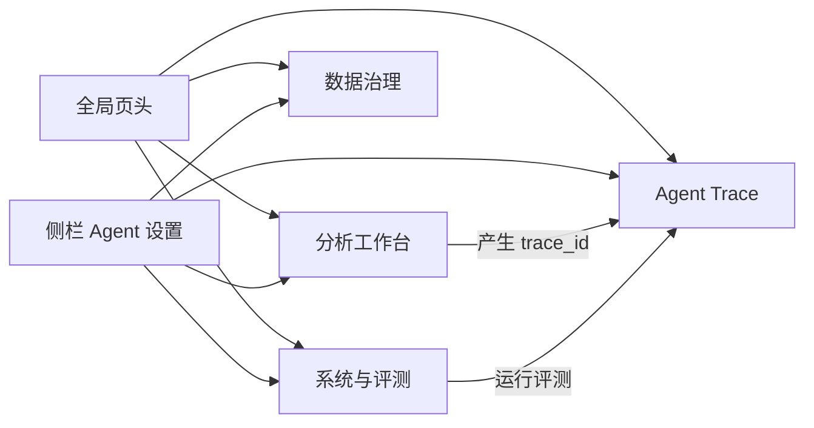
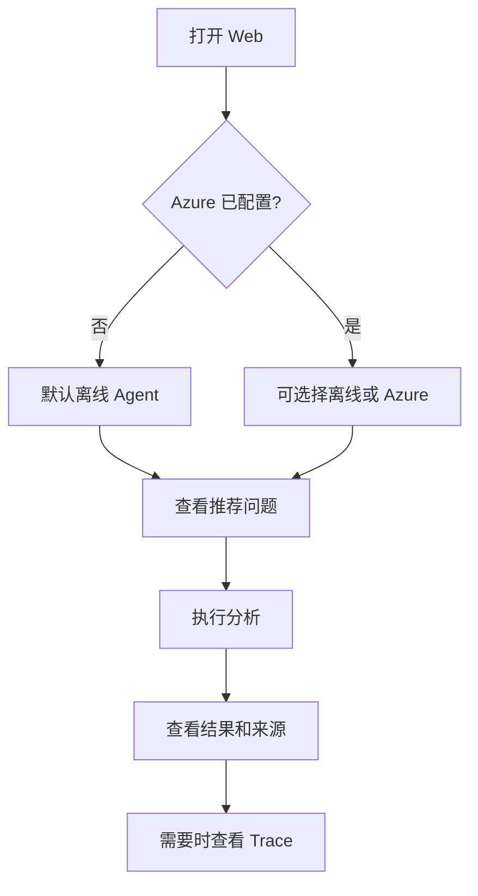
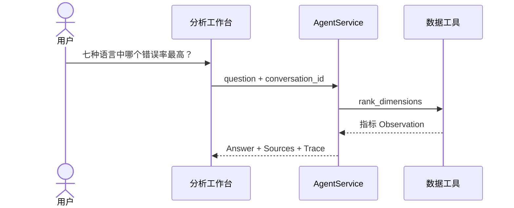
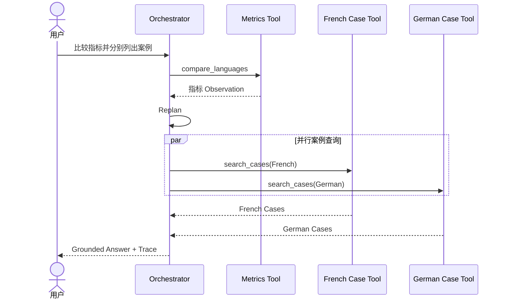

# 智能座舱多语言语音质量数据分析与治理 Agent：原型设计

> 文档类型：交互原型与界面规格说明  
> 当前原型：Streamlit Web 工作台  
> 设计目标：让业务用户完成分析，让开发者看见 Agent 如何完成分析  
> 对应需求：`REQUIREMENTS_DESIGN.md`

---

## 1. 原型目标

原型不是一个只有输入框的聊天页面。它需要同时回答三个问题：

1. **用户能做什么分析？**
2. **这次分析得到了什么结果和来源？**
3. **Supervisor 进入了分析还是治理流程，经过了哪些工具和验证步骤？**

因此信息架构分为四个工作区：

```text
智能座舱多语言语音质量数据分析与治理 Agent
├─ UI-01 分析工作台
├─ UI-02 数据治理
├─ UI-03 Agent Trace
└─ UI-04 系统与评测
```

---

## 2. 设计原则

### 2.1 结果优先，过程可展开

用户先看到结论、表格和案例；工具 Observation、来源和 warning 放在可展开区域。

### 2.2 明确区分事实与系统状态

- 数据结果使用正文和表格；
- Grounding、工具数和 Trace 使用状态条；
- warning 使用独立提示；
- Azure 配置、系统健康和评测放在系统页。

### 2.3 不把 Agent 做成黑盒

复杂问题必须能在 Trace 页面看到：

```text
Plan -> Dispatch -> Specialist -> Tool -> Replan -> Synthesis -> Verify -> Answer
```

### 2.4 不在界面中收集密钥

前端只展示安全状态和本地命令，不提供 API Key 输入框，避免密钥进入浏览器状态、截图或会话记录。

### 2.5 桌面用于分析，移动端保持可查看

桌面优先支持表格、Observation 和 Trace；移动端保证无页面级横向溢出，复杂表格允许组件内部滚动。

---

## 3. 用户与任务

| 用户 | 首要任务 | 主要页面 |
|---|---|---|
| 测试/分析人员 | 查指标、比语言、找 Case | UI-01 |
| 业务负责人 | 查看结论、来源和口径 | UI-01 |
| 数据 Owner/审批人 | Issue、Diff、审批、发布和回滚 | UI-02 |
| Agent 开发者 | 查看规划、工具和验证 | UI-03 |
| 项目维护者 | 检查 Provider、Skills、LLM 和评测 | UI-04 |

---

## 4. 全局信息架构



### 4.1 全局页头

固定信息：

- 产品英文名：Intelligent Cockpit Multilingual Voice Quality Data Agent；
- 产品中文名：智能座舱多语言语音质量数据分析与治理 Agent；
- 一句话说明；
- 当前数据规模：2 Providers、92,301 ASR Cases、104,897 NLU Samples、7 Languages、6 Domains；
- 核心技术简写：DuckDB + LangGraph + FTS5 + SQLite。

页头目的：让第一次打开的人在 10 秒内知道产品是什么、分析什么数据。

### 4.2 全局导航

使用分段控制：

```text
[分析工作台] [数据治理] [Agent Trace] [系统与评测]
```

原因：四个页面是并列工作区，不是层级菜单；用户应能随时切换。

### 4.3 侧栏

内容：

- Agent 模式选择；
- Azure 配置状态；
- 缺失配置说明；
- 清空当前对话。

模式规则：

- 永远显示“离线确定性 Agent”；
- 只有 Azure 配置校验通过后才显示“Azure OpenAI Agent”；
- 不允许选择一个无法初始化的 Azure 模式。

---

## 5. UI-01 分析工作台

### 5.1 页面目标

让用户使用自然语言完成指标、比较、案例、口径和知识分析，并确认结果是否可信。

### 5.2 空状态线框

```text
┌────────────────────────────────────────────────────────────────────┐
│ Intelligent Cockpit Multilingual Voice Quality Data Agent         │
│ 智能座舱多语言语音质量数据分析与治理 Agent                        │
│ 2 Providers · 92,301 ASR Cases · 104,897 NLU Samples             │
├────────────────────────────────────────────────────────────────────┤
│ [分析工作台] [数据治理] [Agent Trace] [系统与评测]                 │
├────────────────────────────────────────────────────────────────────┤
│ 协作链：Supervisor → Analysis/Governance → Synthesize → Verify    │
│                                                                    │
│ 试试这些多步骤问题                                                 │
│ ┌──────────────────────────┐ ┌──────────────────────────────────┐ │
│ │ 七种语言中哪个错误率最高 │ │ 比较德语和法语并分别列出案例     │ │
│ └──────────────────────────┘ └──────────────────────────────────┘ │
│ ┌──────────────────────────┐ ┌──────────────────────────────────┐ │
│ │ 找出 TuneIn 错误案例      │ │ 比较法语 CSV 和 JSON 口径        │ │
│ └──────────────────────────┘ └──────────────────────────────────┘ │
│                                                                    │
│ [ 输入跨语言指标、案例、口径或业务定义问题                 ][发送] │
└────────────────────────────────────────────────────────────────────┘
```

### 5.3 推荐问题

当前六个推荐问题覆盖：

- 全局语言排名；
- 多步骤比较与案例；
- 关键词 Case 搜索；
- CSV/JSON 口径；
- 指标定义；
- 数据质量。

点击后：

1. 写入 `pending_question`；
2. 重新渲染；
3. 进入与手工输入相同的处理链；
4. 不维护第二套推荐问题逻辑。

### 5.4 用户消息

样式：聊天消息容器，仅展示原始问题。  
要求：保留用户输入，不在 UI 层改写问题。

### 5.5 Agent 回答

内容顺序：

```text
结论
-> 数据证据
-> 案例/知识片段
-> 口径与限制
-> Agent 状态条
-> Observation 与来源（折叠）
```

回答状态条必须展示：

- `Grounded 校验通过` 或 `Grounding 未通过`；
- 本轮参与的 Agent 数量和完整协作链；
- 本轮工具调用次数；
- Trace ID。

示例：

```text
Grounded 校验通过 · 4 个 Agent · 3 次工具调用 · Trace b746fc...
协作链：supervisor → analysis_agent
```

### 5.6 Observation 与来源展开区

展开区先展示每个 SpecialistResult 的 Agent、成功状态、summary 和 error，再展示每个 Observation：

- 工具名；
- 执行耗时；
- 是否命中缓存；
- `rows` 表格或 `data` JSON；
- 来源 label、scope 和 path；
- warning。

展开区默认折叠，避免业务用户首先面对工程细节。

### 5.7 输入和提交状态

| 状态 | 页面行为 |
|---|---|
| 空输入 | 发送按钮不可用 |
| 已提交 | 立即显示用户消息 |
| 执行中 | 显示“Agent 正在规划并执行数据工具...” |
| 成功 | 追加 AgentAnswer |
| 异常 | 显示错误，不清除已有对话 |
| 越界 | 返回平台能力和可提问示例，不调用通用常识回答 |

### 5.8 多轮上下文

页面保存 `conversation_id`。后续问题传递同一 ID，使后端读取语言、domain 和上一轮 Case。

清空对话时清除：

- `messages`；
- `conversation_id`；
- `last_trace_id`。

不会删除后端历史 Trace，用于审计和回放。

---

## 6. UI-02 数据治理

### 6.1 页面目标

让数据治理 Agent 发现和跟踪质量问题，同时确保所有数据变更经过结构化差异预览、用户显式确认、版本发布和回滚。

### 6.2 页面结构

```text
┌────────────────────────────────────────────────────────────────────┐
│ 数据治理                   [Active Version: raw] [扫描数据质量]    │
│ raw 数据永不覆盖；Agent 只创建 Issue 和 Draft                      │
├────────────────────────────────────────────────────────────────────┤
│ Issue 状态 [OPEN]  严重级别 [全部]                                │
│ [Issue / 级别 / 规则 / 实体 / 字段 / 状态 / 说明]                  │
│ 选择 Issue → 展开证据                                               │
│ 字段级问题 → [建议值] [操作记录] [理由] [创建 Draft]               │
├────────────────────────────────────────────────────────────────────┤
│ 变更建议与人工确认                                                  │
│ [Before / After / 状态 / 创建人 / 确认人]                          │
│ Diff Preview                                                        │
│ DRAFT → 用户检查 Diff 与契约结果 → CONFIRMED                       │
│ CONFIRMED → 发布新 Dataset Version                                 │
├────────────────────────────────────────────────────────────────────┤
│ Active Version → 回滚父版本                                        │
│ Governance Audit Log                                                │
└────────────────────────────────────────────────────────────────────┘
```

### 6.3 治理状态

```text
Issue: OPEN → IN_REVIEW → RESOLVED / WAIVED
Change: DRAFT → CONFIRMED → PUBLISHED → ROLLED_BACK
```

### 6.4 安全交互规则

- 扫描只写 Issue，不修改 raw；
- 只有 Data Contract 中 `mutable=true` 的字段可创建 Patch；
- 范围级 CSV/JSON 问题不能创建单字段 Patch；
- 聊天 Agent 不能替用户确认 Change；
- 当前单机版不要求企业登录、RBAC 或独立审批人；
- 发布前始终显示 Diff Preview；
- 发布创建新 active version，不覆盖源文件；
- 回滚需要明确操作人并写 Audit。

### 6.5 通用性展示

系统页展示已注册 Data Contract；治理页面按 Provider 工作。ASR 特有规则由 Adapter 提供，Contract Scanner 的 required/type/enum/range/unique 规则可直接用于其他表格数据。

---

## 7. UI-03 Agent Trace

### 7.1 页面目标

让开发者、评审人和面试官看见一次回答如何产生，并快速定位失败环节。

### 7.2 线框

```text
┌────────────────────────────────────────────────────────────────────┐
│ Trace ID [ b746fc8895c44af2bd40096d5a67bf9b ]                     │
│                                                                    │
│ Agent 执行轨迹                                                     │
│ PLAN       orchestrator             2026-...                       │
│   [展开 Plan 详情]                                                 │
│ TOOL       compare_languages        2026-...                       │
│   [展开 ToolCall + Observation]                                    │
│ REPLAN     orchestrator             2026-...                       │
│ TOOL       search_cases             2026-...                       │
│ TOOL       search_cases             2026-...                       │
│ VERIFY     grounding_verifier       2026-...                       │
│ ANSWER     answer_composer           2026-...                       │
└────────────────────────────────────────────────────────────────────┘
```

### 7.3 Trace 输入

默认值：当前 Session 中最近一次回答的 Trace ID。  
用户也可以粘贴历史 Trace ID。

### 7.4 Event 行

每行固定三列：

```text
event_type | name | created_at
```

事件类型：

- plan；
- tool；
- replan；
- verify；
- answer；
- error。

每行可展开查看 payload，不在主列表直接渲染大 JSON。

### 7.5 关键诊断问题

Trace 应能回答：

- Planner 选择了哪个工具？
- 参数是否带对语言和 domain？
- 是否发生第二轮规划？
- 哪些工具并行执行？
- Tool 返回了什么 warning？
- Grounding 为什么通过或失败？
- Azure 回答是否降级？

### 7.6 空与错误状态

| 情况 | 文案 |
|---|---|
| 没有 Trace ID | “先在分析工作台执行一个问题，或输入已有 Trace ID。” |
| Trace 不存在 | “没有找到该 Trace。” |
| Payload 很大 | 默认折叠，由用户展开 |

---

## 8. UI-04 系统与评测

### 8.1 页面目标

集中展示数据接入、Provider、Skills、工具运行、Azure 状态和 Agent 评测。

### 8.2 页面结构

```text
┌────────────────────────────────────────────────────────────────────┐
│ [Case 92,301] [语言 7] [Domain 6] [治理候选 44]                  │
├────────────────────────────────────────────────────────────────────┤
│ Provider 与工具  {...}                                             │
│ 三 Agent 团队     [Agent / 状态 / 工具权限]                         │
│ 动态 Skills      {...}                                             │
│ Tool Runtime     [统计表]                                          │
├────────────────────────────────────────────────────────────────────┤
│ Azure OpenAI                                                       │
│ 配置状态 / 缺失项 / 连接测试                                      │
│ [调用数] [成功率] [平均延迟] [Tokens]                              │
├────────────────────────────────────────────────────────────────────┤
│ 端到端评测                                                         │
│ [运行 25 条核心 Multi-Agent 评测]                                 │
│ [通过率] [工具准确率] [Agent准确率] [答案准确率] [引用准确率]      │
│ 基线状态 / Regression / 逐条结果表                                 │
└────────────────────────────────────────────────────────────────────┘
```

### 8.3 数据概览指标

固定四项：

- Case；
- 语言；
- Domain；
- 数据质量问题。

这里不继续增加大量业务指标，避免系统页变成 BI 看板。

### 8.4 Provider 与工具

使用折叠 JSON 显示：

- Composite Provider readiness；
- 每个 Provider 的数据规模；
- 注册工具列表；
- 知识分片数量。

### 8.5 Dynamic Skills

显示：

- 已加载数量；
- Skill 名称；
- keywords；
- agents；
- 解析错误。

当前 API 支持热重载；UI 当前仅展示，下一阶段可增加重载按钮和确认提示。

### 8.6 三 Agent 团队

表格展示：

- 任务编排 Agent、数据分析 Agent、数据治理 Agent；
- Ready/Unavailable；
- Analysis 与 Governance 的工具白名单；
- Supervisor 显示“无业务工具”；AnswerSynthesizer、Grounding、Human Confirmation 单独列为组件。

### 8.7 Tool Runtime

有调用时显示表格：

- tool；
- total；
- success_rate；
- average_ms；
- consecutive_failures；
- circuit_state。

无调用时显示：

> 当前进程尚未执行工具。

### 8.8 Azure 未配置状态

必须显示：

- “尚未配置 Azure；离线 Agent 不受影响”；
- 每个缺失配置；
- `llm init/status/test` 命令；
- LLM 调用指标为 0。

不得显示 API Key 输入框。

### 8.9 Azure 已配置状态

显示：

- Endpoint host；
- Deployment；
- “测试 Azure 连接”按钮；
- 成功时显示延迟和 token；
- 失败时显示错误类型和可理解信息。

编辑 `.env` 后刷新可重新读取状态；切换完整 Azure Agent 建议重启服务。

### 8.10 Multi-Agent 评测

点击“运行 25 条核心 Multi-Agent 评测”后：

1. 运行真实 AgentService；
2. 展示 Pass、Tool、Agent、Answer 和 Citation 五项指标；
3. 与当前模式基线比较；
4. 有超过 5% 的回归时显示错误；
5. 无回归时显示成功；
6. 无基线时提示如何使用 CLI 创建；
7. 展示逐条结果表。

---

## 9. 关键交互流程

### 9.1 首次使用



### 9.2 简单指标问题



### 9.3 复合问题



### 9.4 Azure 配置

```text
侧栏/系统页看到未配置
-> 本机运行 data-agent llm init
-> 编辑 .env
-> llm status
-> llm test
-> 刷新页面
-> 选择 Azure OpenAI Agent
-> 执行简单问题
-> 检查 Trace
-> 执行 Azure 评测
```

---

## 10. 页面状态规范

### 10.1 状态类型

| 状态 | 视觉与文案要求 |
|---|---|
| Success | 绿色语义 + 明确文字，如“Grounded 校验通过” |
| Warning | 琥珀语义 + 具体口径或限制 |
| Error | 红色语义 + 错误类型和下一步 |
| Loading | Spinner + 当前动作，不显示虚假进度百分比 |
| Empty | 解释为什么为空并给下一步 |
| Unsupported | 说明已注册范围并提供可问示例 |
| Cached | 在工具行显示 `cache`，不改变结果语义 |

### 10.2 Grounding 状态

- 通过：展示 `Grounded 校验通过`；
- 未通过：展示 `Grounding 未通过`；
- Azure 未通过：后端降级为确定性回答，Trace 记录 fallback；
- 不允许只用绿色/红色而无文字。

### 10.3 数据口径 warning

warning 不能隐藏在来源路径中，必须出现在回答的“口径与限制”或 Observation 展开区。

---

## 11. 响应式设计

### 桌面端（≥ 1024px）

- 最大内容宽度 1440px；
- 指标四列；
- 推荐问题两列；
- Trace 三列；
- 数据表使用完整宽度。

### 平板端（761–1023px）

- 推荐问题可保持两列或按空间折行；
- 指标允许两行；
- 表格组件内部滚动。

### 移动端（≤ 760px）

- Trace 行改为单列；
- 页面左右 padding 1rem；
- 侧栏可折叠；
- 页面级 `scrollWidth` 不得超过 viewport；
- 长表格只允许组件内部滚动；
- 按钮文字允许换行但不得截断。

当前已在 390px 视口验证无页面级水平溢出。

---

## 12. 文案规范

### 推荐用词

- “分析目标”，不是“随便问我”；
- “数据来源”，不是“参考资料”；
- “口径与限制”，不是“免责声明”；
- “Agent Trace”，保留技术辨识度；
- “Grounded 校验通过”，明确可信机制；
- “离线确定性 Agent / Azure OpenAI Agent”，明确模式差异。

### 避免用词

- “100% 准确”；
- “企业级生产可用”；
- “万能数据助手”；
- “智能客服”；
- “Hybrid RAG 已完成离线基础实现；Azure Embedding 与模型重排待在线验收”；
- “MCP Server 已通过官方 FastMCP 实现；当前仅暴露批准的查询与预览工具”。

---

## 13. 无障碍要求

- 所有输入和模式控件具有可读 label；
- 成功/失败不只依赖颜色；
- 表格列名明确；
- 交互元素支持键盘聚焦；
- 展开区标题表达内容，不使用只有图标的模糊按钮；
- 中文与拉丁字符字体保持可读；
- 文本对比度满足常规办公界面要求。

---

## 14. 当前原型已实现与下一阶段

### 已实现

- 三工作区；
- 离线/Azure 模式状态；
- 推荐问题；
- 多轮对话；
- Answer、Observation、来源和 warning；
- Grounding 状态；
- Trace 查看；
- Provider、Skills 和 Tool Runtime；
- Azure 配置状态与连接测试；
- LLM token/延迟统计；
- 多 Agent 团队和工具权限表；
- 25 条 Multi-Agent 评测和基线提示；
- 当前回答完整 JSON 与展平 Observation CSV 下载；
- Azure 6 条 smoke / 25 条完整回归分级入口、费用确认、per-run 成本/P95 和历史运行；
- 桌面和移动响应式。

### 下一阶段原型

- 正式报告生成和下载；
- 会话历史列表；
- Trace 筛选和对比；
- Skill 重载按钮与确认；
- 数据源重新导入进度与结果；
- 企业身份、权限和用户区分；
- 评测失败详情侧栏；
- 数据版本和趋势页面（需要新增源数据维度）。

---

## 15. 原型验收清单

- [ ] 首屏 10 秒内说明产品、数据规模和可做任务；
- [ ] 推荐问题可直接执行；
- [ ] 复合问题显示指标和对应案例；
- [ ] 回答显示 Grounding、Agent 数、协作链、工具数和 Trace ID；
- [ ] Observation 和来源可展开；
- [ ] Trace 展示 Dispatch、Specialist、Synthesis 和完整协作循环；
- [ ] Azure 未配置时给出可执行命令；
- [ ] Azure 配置后可测试连接；
- [ ] 系统页显示 Provider、Skills、工具和 LLM 指标；
- [ ] 评测显示基线和 Regression；
- [ ] 越界问题显示能力范围；
- [ ] 390px 无页面级水平溢出；
- [ ] 页面名称统一为“智能座舱多语言语音质量数据分析与治理 Agent”。
